# AgentSkill协议支持 - 架构设计文档

## 一、系统概述

### 1.1 项目背景
为Agent平台（类似coze.cn的低码大模型应用平台）新增AgentSkill协议支持，遵循agentskills.io开放标准。

### 1.2 设计目标
- 支持开发者上传和管理Skill
- 提供Skill审核发布流程
- 建立Skill商店生态
- 支持Agent与Skill的灵活绑定
- 兼容agentskills.io开放生态

---

## 二、系统架构

### 2.1 整体架构图

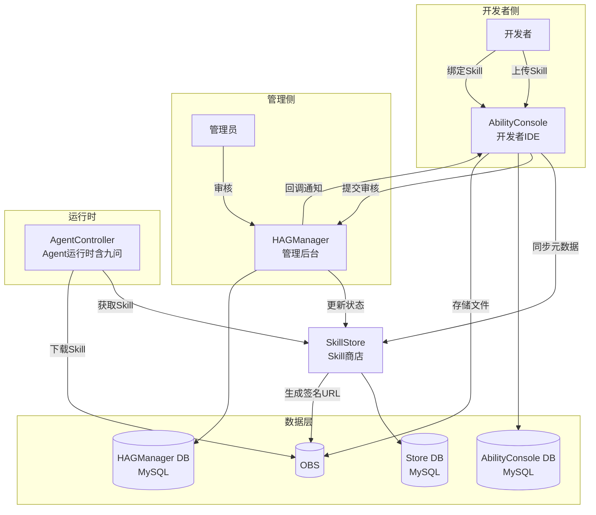
```mermaid
graph TB
    subgraph "开发者侧"
        Dev[开发者]
        AC[AbilityConsole<br/>开发者IDE]
    end

    subgraph "管理侧"
        Admin[管理员]
        HM[HAGManager<br/>管理后台]
    end

    subgraph "运行时"
        RT[AgentController<br/>Agent运行时含九问]
    end

    subgraph "数据层"
        ACDB[(AbilityConsole DB<br/>MySQL)]
        HMDB[(HAGManager DB<br/>MySQL)]
        SSDB[(Store DB<br/>MySQL)]
        OBS[(OBS)]
    end

    SS[SkillStore<br/>Skill商店]

    Dev -->|上传Skill| AC
    Dev -->|绑定Skill| AC
    Admin -->|审核| HM
    RT -->|获取Skill| SS

    AC -->|同步元数据| SS
    AC -->|提交审核| HM
    HM -->|更新状态| SS
    HM -->|回调通知| AC

    AC --> ACDB
    HM --> HMDB
    SS --> SSDB

    AC -->|存储文件| OBS
    SS -->|生成签名URL| OBS
    RT -->|下载Skill| OBS
```

### 2.2 服务依赖关系图

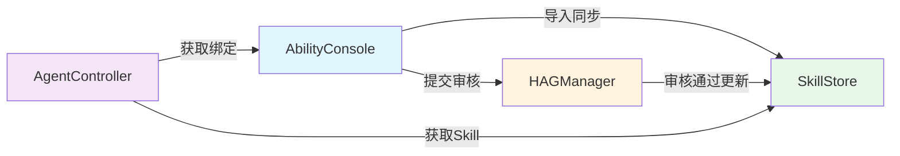
```mermaid
graph LR
    AC[AbilityConsole] -->|导入同步| SS[SkillStore]
    AC -->|提交审核| AM[HAGManager]
    AM -->|审核通过更新| SS
    RT[AgentController] -->|获取绑定| AC
    RT -->|获取Skill| SS

    style AC fill:#e1f5fe
    style AM fill:#fff3e0
    style SS fill:#e8f5e9
    style RT fill:#f3e5f5
```

### 2.3 微服务架构分层图

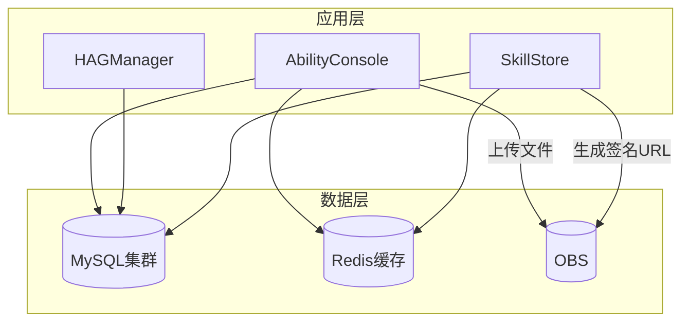
```mermaid
graph TB
    subgraph "应用层"
        AC[AbilityConsole]
        HM[HAGManager]
        SS[SkillStore]
    end

    subgraph "数据层"
        MySQL[(MySQL集群)]
        Redis[(Redis缓存)]
        OBS[(OBS)]
    end

    AC --> MySQL
    HM --> MySQL
    SS --> MySQL

    AC --> Redis
    SS --> Redis

    AC -->|上传文件| OBS
    SS -->|生成签名URL| OBS
```

---

## 三、核心流程设计

### 3.1 Skill导入流程

#### 时序图
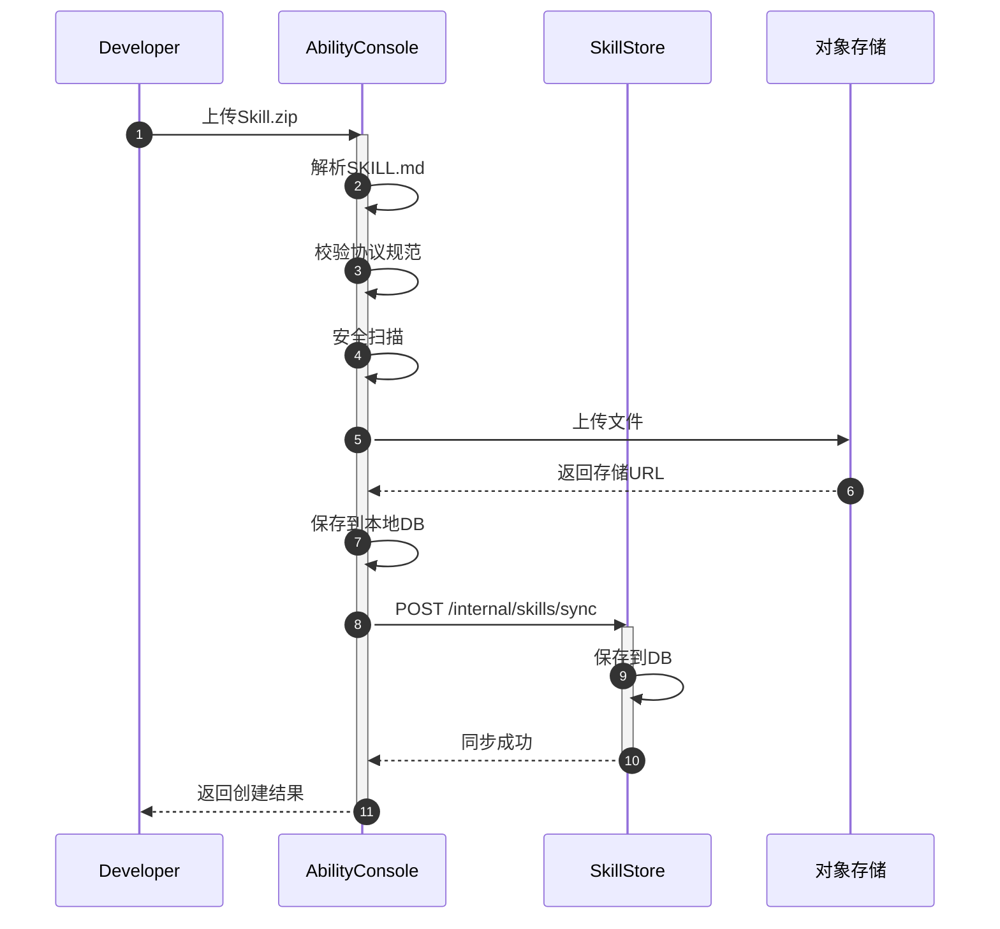
```mermaid
sequenceDiagram
    autonumber
    participant D as Developer
    participant AC as AbilityConsole
    participant SS as SkillStore
    participant OBS as 对象存储

    D->>AC: 上传Skill.zip
    activate AC

    AC->>AC: 解析SKILL.md
    AC->>AC: 校验协议规范
    AC->>AC: 安全扫描

    AC->>OBS: 上传文件
    OBS-->>AC: 返回存储URL

    AC->>AC: 保存到本地DB

    AC->>SS: POST /internal/skills/sync
    activate SS
    SS->>SS: 保存到DB
    SS-->>AC: 同步成功
    deactivate SS

    AC-->>D: 返回创建结果
    deactivate AC
```

#### 流程图
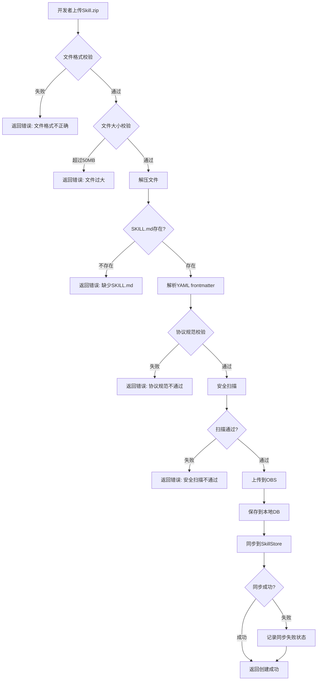
```mermaid
flowchart TD
    A[开发者上传Skill.zip] --> B{文件格式校验}
    B -->|失败| Z1[返回错误: 文件格式不正确]
    B -->|通过| C{文件大小校验}
    C -->|超过50MB| Z2[返回错误: 文件过大]
    C -->|通过| D[解压文件]
    D --> E{SKILL.md存在?}
    E -->|不存在| Z3[返回错误: 缺少SKILL.md]
    E -->|存在| F[解析YAML frontmatter]
    F --> G{协议规范校验}
    G -->|失败| Z4[返回错误: 协议规范不通过]
    G -->|通过| H[安全扫描]
    H --> I{扫描通过?}
    I -->|失败| Z5[返回错误: 安全扫描不通过]
    I -->|通过| J[上传到OBS]
    J --> K[保存到本地DB]
    K --> L[同步到SkillStore]
    L --> M{同步成功?}
    M -->|失败| N[记录同步失败状态]
    M -->|成功| O[返回创建成功]
    N --> O
```

### 3.2 提交审核流程

#### 时序图
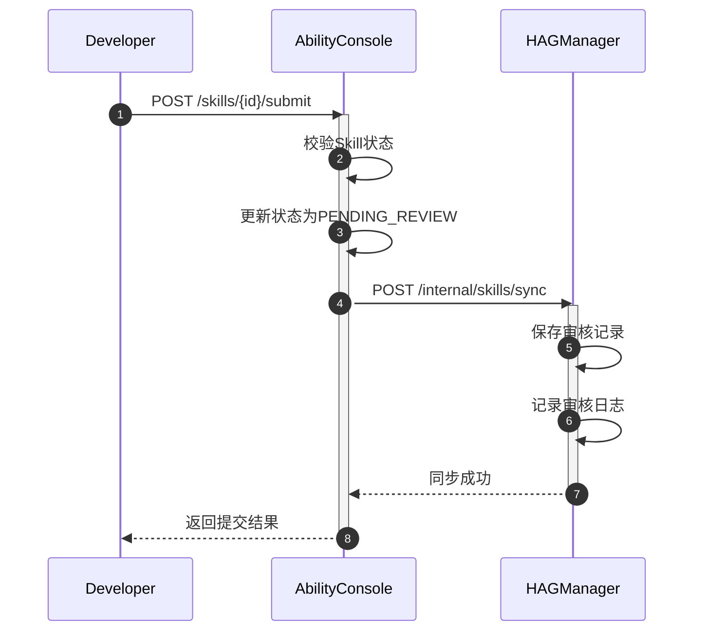
```mermaid
sequenceDiagram
    autonumber
    participant D as Developer
    participant AC as AbilityConsole
    participant AM as HAGManager

    D->>AC: POST /skills/{id}/submit
    activate AC

    AC->>AC: 校验Skill状态
    AC->>AC: 更新状态为PENDING_REVIEW

    AC->>AM: POST /internal/skills/sync
    activate AM
    AM->>AM: 保存审核记录
    AM->>AM: 记录审核日志
    AM-->>AC: 同步成功
    deactivate AM

    AC-->>D: 返回提交结果
    deactivate AC
```

#### 流程图
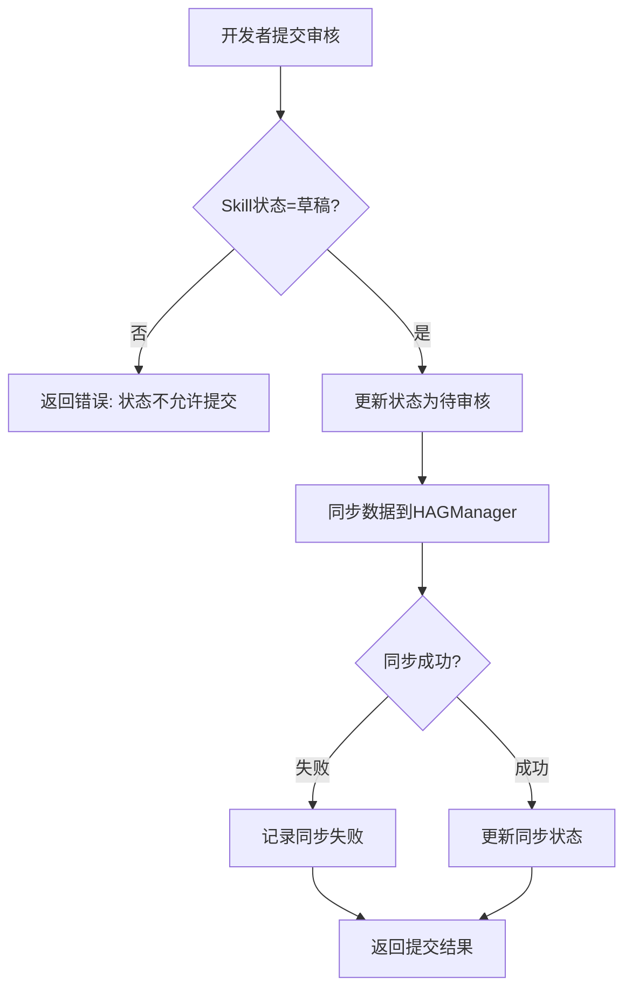
```mermaid
flowchart TD
    A[开发者提交审核] --> B{Skill状态=草稿?}
    B -->|否| Z1[返回错误: 状态不允许提交]
    B -->|是| C[更新状态为待审核]
    C --> D[同步数据到HAGManager]
    D --> E{同步成功?}
    E -->|失败| F[记录同步失败]
    E -->|成功| G[更新同步状态]
    F --> H[返回提交结果]
    G --> H
```

### 3.3 审核通过流程

#### 时序图
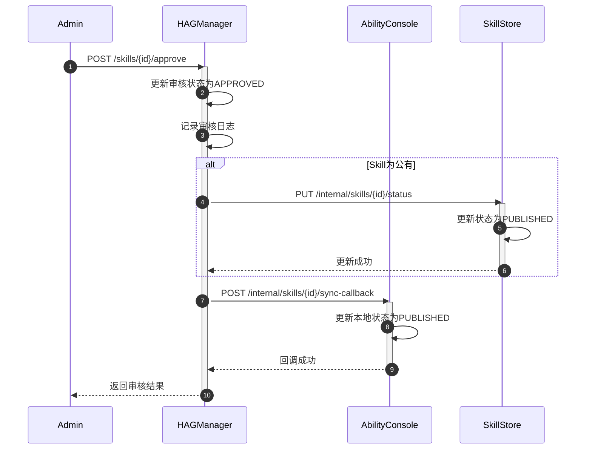
```mermaid
sequenceDiagram
    autonumber
    participant A as Admin
    participant AM as HAGManager
    participant AC as AbilityConsole
    participant SS as SkillStore

    A->>AM: POST /skills/{id}/approve
    activate AM

    AM->>AM: 更新审核状态为APPROVED
    AM->>AM: 记录审核日志

    alt Skill为公有
        AM->>SS: PUT /internal/skills/{id}/status
        activate SS
        SS->>SS: 更新状态为PUBLISHED
        SS-->>AM: 更新成功
        deactivate SS
    end

    AM->>AC: POST /internal/skills/{id}/sync-callback
    activate AC
    AC->>AC: 更新本地状态为PUBLISHED
    AC-->>AM: 回调成功
    deactivate AC

    AM-->>A: 返回审核结果
    deactivate AM
```

#### 审核决策流程图
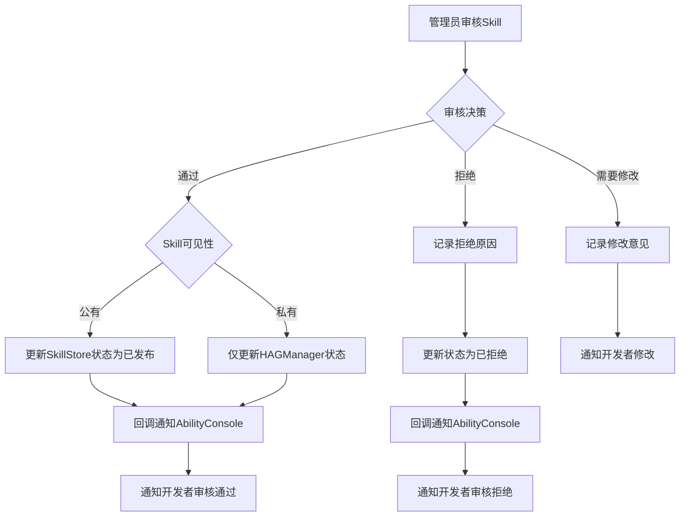
```mermaid
flowchart TD
    A[管理员审核Skill] --> B{审核决策}
    B -->|通过| C{Skill可见性}
    C -->|公有| D[更新SkillStore状态为已发布]
    C -->|私有| E[仅更新HAGManager状态]
    D --> F[回调通知AbilityConsole]
    E --> F
    F --> G[通知开发者审核通过]

    B -->|拒绝| H[记录拒绝原因]
    H --> I[更新状态为已拒绝]
    I --> J[回调通知AbilityConsole]
    J --> K[通知开发者审核拒绝]

    B -->|需要修改| L[记录修改意见]
    L --> M[通知开发者修改]
```

### 3.4 AgentController获取Skill流程

#### 时序图
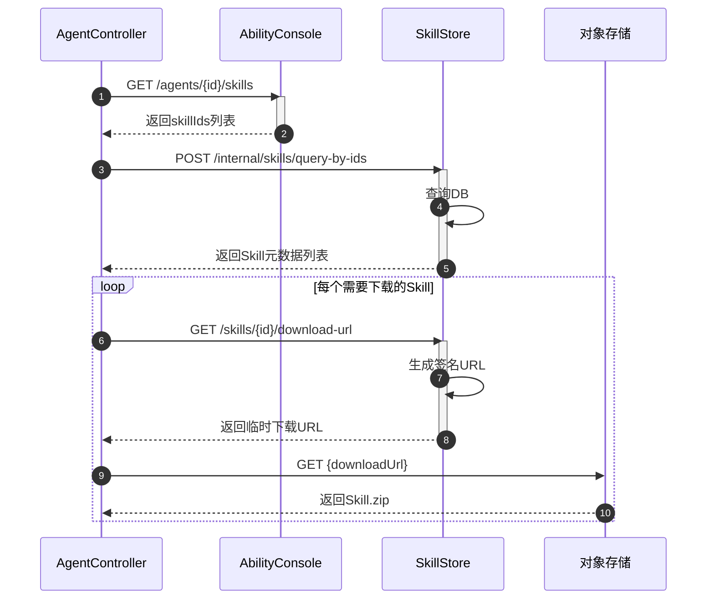
```mermaid
sequenceDiagram
    autonumber
    participant RT as AgentController
    participant AC as AbilityConsole
    participant SS as SkillStore
    participant OBS as 对象存储

    RT->>AC: GET /agents/{id}/skills
    activate AC
    AC-->>RT: 返回skillIds列表
    deactivate AC

    RT->>SS: POST /internal/skills/query-by-ids
    activate SS
    SS->>SS: 查询DB
    SS-->>RT: 返回Skill元数据列表
    deactivate SS

    loop 每个需要下载的Skill
        RT->>SS: GET /skills/{id}/download-url
        activate SS
        SS->>SS: 生成签名URL
        SS-->>RT: 返回临时下载URL
        deactivate SS

        RT->>OBS: GET {downloadUrl}
        OBS-->>RT: 返回Skill.zip
    end
```

#### 流程图
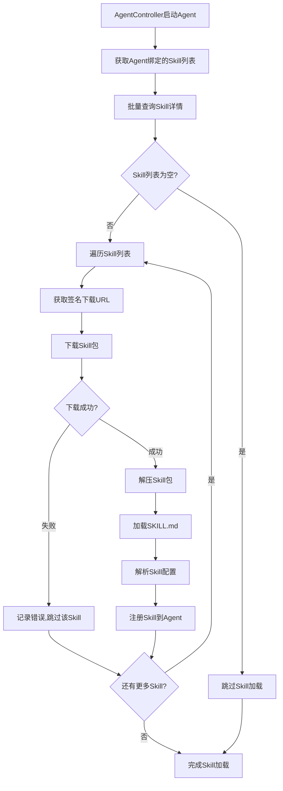
```mermaid
flowchart TD
    A[AgentController启动Agent] --> B[获取Agent绑定的Skill列表]
    B --> C[批量查询Skill详情]
    C --> D{Skill列表为空?}
    D -->|是| E[跳过Skill加载]
    D -->|否| F[遍历Skill列表]
    F --> G[获取签名下载URL]
    G --> H[下载Skill包]
    H --> I{下载成功?}
    I -->|失败| J[记录错误,跳过该Skill]
    I -->|成功| K[解压Skill包]
    K --> L[加载SKILL.md]
    L --> M[解析Skill配置]
    M --> N[注册Skill到Agent]
    J --> O{还有更多Skill?}
    N --> O
    O -->|是| F
    O -->|否| P[完成Skill加载]
    E --> P
```

### 3.5 Agent-Skill绑定流程

#### 时序图
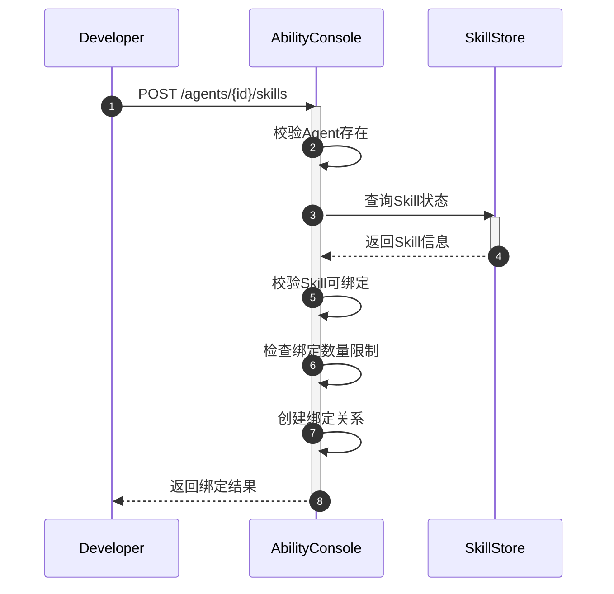
```mermaid
sequenceDiagram
    autonumber
    participant D as Developer
    participant AC as AbilityConsole
    participant SS as SkillStore

    D->>AC: POST /agents/{id}/skills
    activate AC

    AC->>AC: 校验Agent存在
    AC->>SS: 查询Skill状态
    activate SS
    SS-->>AC: 返回Skill信息
    deactivate SS

    AC->>AC: 校验Skill可绑定
    AC->>AC: 检查绑定数量限制
    AC->>AC: 创建绑定关系
    AC-->>D: 返回绑定结果
    deactivate AC
```

#### 绑定校验流程图
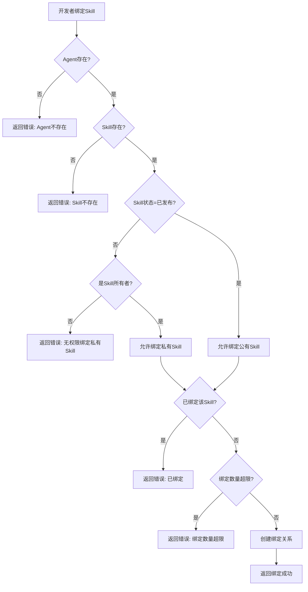
```mermaid
flowchart TD
    A[开发者绑定Skill] --> B{Agent存在?}
    B -->|否| Z1[返回错误: Agent不存在]
    B -->|是| C{Skill存在?}
    C -->|否| Z2[返回错误: Skill不存在]
    C -->|是| D{Skill状态=已发布?}
    D -->|否| E{是Skill所有者?}
    E -->|否| Z3[返回错误: 无权限绑定私有Skill]
    E -->|是| F[允许绑定私有Skill]
    D -->|是| G[允许绑定公有Skill]
    F --> H{已绑定该Skill?}
    G --> H
    H -->|是| Z4[返回错误: 已绑定]
    H -->|否| I{绑定数量超限?}
    I -->|是| Z5[返回错误: 绑定数量超限]
    I -->|否| J[创建绑定关系]
    J --> K[返回绑定成功]
```

---

## 四、状态机设计

### 4.1 Skill生命周期状态机

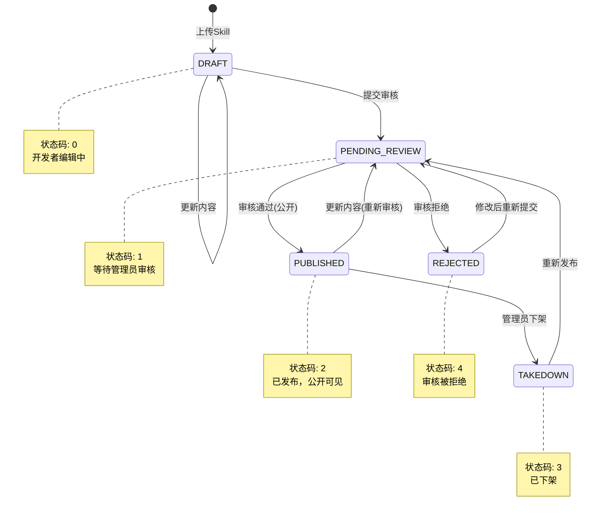
```mermaid
stateDiagram-v2
    [*] --> DRAFT: 上传Skill

    DRAFT --> PENDING_REVIEW: 提交审核
    DRAFT --> DRAFT: 更新内容

    PENDING_REVIEW --> PUBLISHED: 审核通过(公开)
    PENDING_REVIEW --> REJECTED: 审核拒绝

    PUBLISHED --> TAKEDOWN: 管理员下架
    PUBLISHED --> PENDING_REVIEW: 更新内容(重新审核)

    REJECTED --> PENDING_REVIEW: 修改后重新提交

    TAKEDOWN --> PENDING_REVIEW: 重新发布

    note right of DRAFT
        状态码: 0
        开发者编辑中
    end note

    note right of PENDING_REVIEW
        状态码: 1
        等待管理员审核
    end note

    note right of PUBLISHED
        状态码: 2
        已发布，公开可见
    end note

    note right of TAKEDOWN
        状态码: 3
        已下架
    end note

    note right of REJECTED
        状态码: 4
        审核被拒绝
    end note
```

### 4.2 审核状态流转图

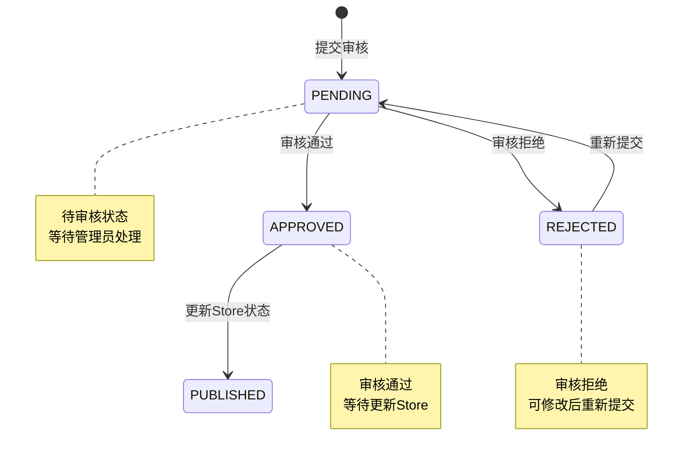
```mermaid
stateDiagram-v2
    [*] --> PENDING: 提交审核

    PENDING --> APPROVED: 审核通过
    PENDING --> REJECTED: 审核拒绝

    APPROVED --> PUBLISHED: 更新Store状态

    REJECTED --> PENDING: 重新提交

    note right of PENDING
        待审核状态
        等待管理员处理
    end note

    note right of APPROVED
        审核通过
        等待更新Store
    end note

    note right of REJECTED
        审核拒绝
        可修改后重新提交
    end note
```

### 4.3 同步状态机

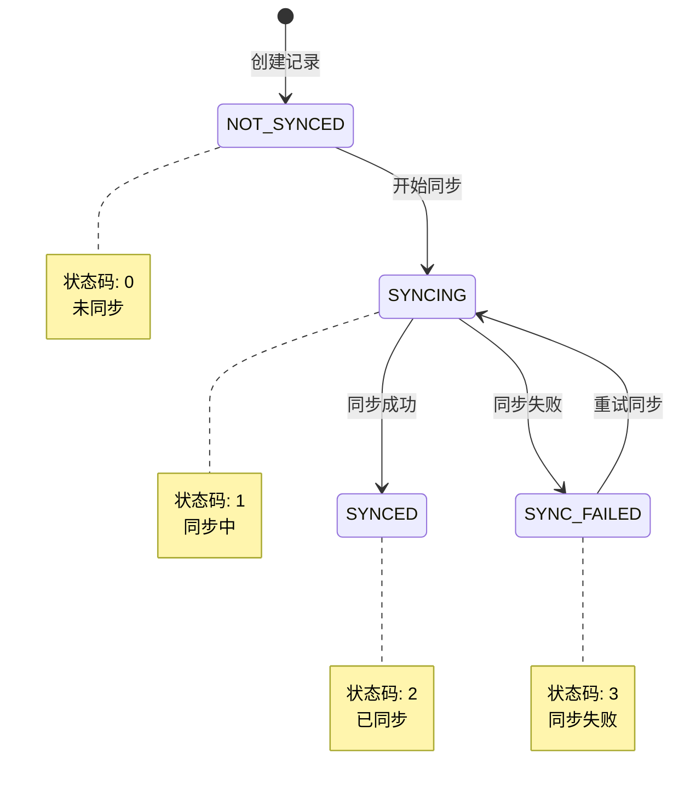
```mermaid
stateDiagram-v2
    [*] --> NOT_SYNCED: 创建记录

    NOT_SYNCED --> SYNCING: 开始同步
    SYNCING --> SYNCED: 同步成功
    SYNCING --> SYNC_FAILED: 同步失败

    SYNC_FAILED --> SYNCING: 重试同步

    note right of NOT_SYNCED
        状态码: 0
        未同步
    end note

    note right of SYNCING
        状态码: 1
        同步中
    end note

    note right of SYNCED
        状态码: 2
        已同步
    end note

    note right of SYNC_FAILED
        状态码: 3
        同步失败
    end note
```

---

## 五、数据模型设计

### 5.1 设计原则

#### 5.1.1 分库策略
- **独立数据库实例**：三个微服务各自独享MySQL实例，实现物理隔离
- **无跨库关联**：通过服务间API调用获取关联数据，避免跨库JOIN
- **数据同步**：通过消息队列或同步API保持数据一致性

#### 5.1.2 ID策略
- **雪花ID(Snowflake)**：全局唯一、时间有序的64位整数ID
- **ID格式**：`{timestamp(41bit)}{datacenter(5bit)}{worker(5bit)}{sequence(12bit)}`
- **跨服务一致性**：Skill ID在首次创建时生成，同步到其他服务时沿用同一ID

### 5.2 数据库分布概览

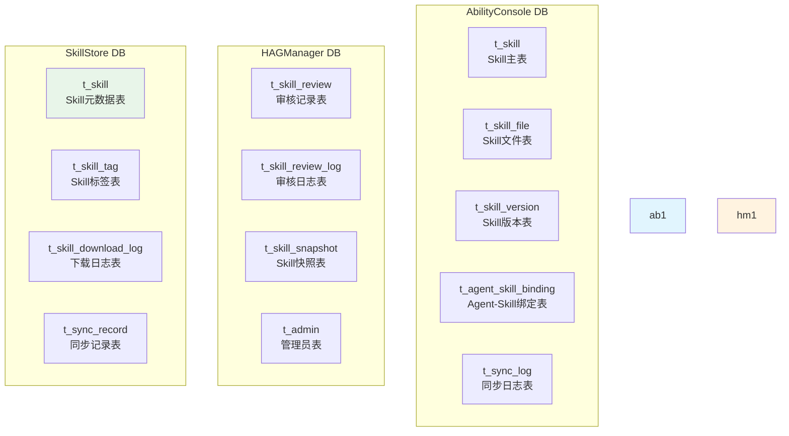
```mermaid
graph TB
    subgraph "AbilityConsole DB"
        AC1[t_skill<br/>Skill主表]
        AC2[t_skill_file<br/>Skill文件表]
        AC3[t_skill_version<br/>Skill版本表]
        AC4[t_agent_skill_binding<br/>Agent-Skill绑定表]
        AC5[t_sync_log<br/>同步日志表]
    end

    subgraph "HAGManager DB"
        AM1[t_skill_review<br/>审核记录表]
        AM2[t_skill_review_log<br/>审核日志表]
        AM3[t_skill_snapshot<br/>Skill快照表]
        AM4[t_admin<br/>管理员表]
    end

    subgraph "SkillStore DB"
        SS1[t_skill<br/>Skill元数据表]
        SS2[t_skill_tag<br/>Skill标签表]
        SS3[t_skill_download_log<br/>下载日志表]
        SS4[t_sync_record<br/>同步记录表]
    end

    style ab1 fill:#e1f5fe
    style hm1 fill:#fff3e0
    style SS1 fill:#e8f5e9
```

---

### 5.3 AbilityConsole 数据库设计

> **数据库**: `ability_console`
> **字符集**: `utf8mb4`
> **排序规则**: `utf8mb4_unicode_ci`

#### 5.3.1 ER图

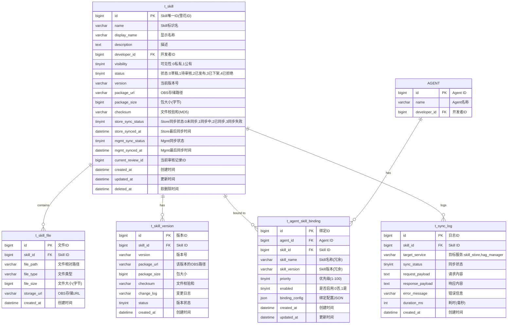
```mermaid
erDiagram
    t_skill ||--o{ t_skill_file : contains
    t_skill ||--o{ t_skill_version : has
    t_skill ||--o{ t_agent_skill_binding : "bound to"
    t_skill ||--o{ t_sync_log : logs
    AGENT ||--o{ t_agent_skill_binding : has

    t_skill {
        bigint id PK "Skill唯一ID(雪花ID)"
        varchar name "Skill标识名"
        varchar display_name "显示名称"
        text description "描述"
        bigint developer_id FK "开发者ID"
        tinyint visibility "可见性:0私有,1公有"
        tinyint status "状态:0草稿,1待审核,2已发布,3已下架,4已拒绝"
        varchar version "当前版本号"
        varchar package_url "OBS存储路径"
        bigint package_size "包大小(字节)"
        varchar checksum "文件校验和(MD5)"
        tinyint store_sync_status "Store同步状态:0未同步,1同步中,2已同步,3同步失败"
        datetime store_synced_at "Store最后同步时间"
        tinyint mgmt_sync_status "Mgmt同步状态"
        datetime mgmt_synced_at "Mgmt最后同步时间"
        bigint current_review_id "当前审核记录ID"
        datetime created_at "创建时间"
        datetime updated_at "更新时间"
        datetime deleted_at "软删除时间"
    }

    t_skill_file {
        bigint id PK "文件ID"
        bigint skill_id FK "Skill ID"
        varchar file_path "文件相对路径"
        varchar file_type "文件类型"
        bigint file_size "文件大小(字节)"
        varchar storage_url "OBS存储URL"
        datetime created_at "创建时间"
    }

    t_skill_version {
        bigint id PK "版本ID"
        bigint skill_id FK "Skill ID"
        varchar version "版本号"
        varchar package_url "该版本的OBS路径"
        bigint package_size "包大小"
        varchar checksum "文件校验和"
        varchar change_log "变更日志"
        tinyint status "版本状态"
        datetime created_at "创建时间"
    }

    t_agent_skill_binding {
        bigint id PK "绑定ID"
        bigint agent_id FK "Agent ID"
        bigint skill_id FK "Skill ID"
        varchar skill_name "Skill名称(冗余)"
        varchar skill_version "Skill版本(冗余)"
        tinyint priority "优先级(1-100)"
        tinyint enabled "是否启用:0否,1是"
        json binding_config "绑定配置JSON"
        datetime created_at "创建时间"
        datetime updated_at "更新时间"
    }

    t_sync_log {
        bigint id PK "日志ID"
        bigint skill_id FK "Skill ID"
        varchar target_service "目标服务:skill_store,hag_manager"
        tinyint sync_status "同步状态"
        text request_payload "请求内容"
        text response_payload "响应内容"
        varchar error_message "错误信息"
        int duration_ms "耗时(毫秒)"
        datetime created_at "创建时间"
    }

    AGENT {
        bigint id PK "Agent ID"
        varchar name "Agent名称"
        bigint developer_id FK "开发者ID"
    }
```

#### 5.3.2 表结构定义

##### t_skill (Skill主表)

| 字段名 | 类型 | 必填 | 默认值 | 说明 |
|--------|------|------|--------|------|
| id | BIGINT | 是 | 雪花ID | 主键 |
| name | VARCHAR(128) | 是 | - | Skill标识名，全局唯一 |
| display_name | VARCHAR(256) | 否 | NULL | 显示名称 |
| description | TEXT | 是 | - | 描述信息 |
| developer_id | BIGINT | 是 | - | 开发者ID，外键关联用户表 |
| visibility | TINYINT | 是 | 0 | 可见性: 0=私有, 1=公有 |
| status | TINYINT | 是 | 0 | 状态: 0=草稿, 1=待审核, 2=已发布, 3=已下架, 4=已拒绝 |
| version | VARCHAR(32) | 是 | '1.0.0' | 当前版本号 |
| package_url | VARCHAR(512) | 是 | - | OBS存储路径 |
| package_size | BIGINT | 是 | 0 | 包大小(字节) |
| checksum | VARCHAR(64) | 否 | NULL | 文件MD5校验和 |
| store_sync_status | TINYINT | 是 | 0 | Store同步状态: 0=未同步, 1=同步中, 2=已同步, 3=同步失败 |
| store_synced_at | DATETIME | 否 | NULL | Store最后同步时间 |
| mgmt_sync_status | TINYINT | 是 | 0 | Mgmt同步状态 |
| mgmt_synced_at | DATETIME | 否 | NULL | Mgmt最后同步时间 |
| current_review_id | BIGINT | 否 | NULL | 当前审核记录ID |
| created_at | DATETIME | 是 | CURRENT_TIMESTAMP | 创建时间 |
| updated_at | DATETIME | 是 | CURRENT_TIMESTAMP | 更新时间 |
| deleted_at | DATETIME | 否 | NULL | 软删除时间 |

**索引设计**:
```sql
PRIMARY KEY (id)
UNIQUE INDEX uk_name (name)
INDEX idx_developer_id (developer_id)
INDEX idx_status (status)
INDEX idx_visibility_status (visibility, status)
INDEX idx_store_sync_status (store_sync_status)
INDEX idx_created_at (created_at)
```

##### t_skill_file (Skill文件表)

| 字段名 | 类型 | 必填 | 默认值 | 说明 |
|--------|------|------|--------|------|
| id | BIGINT | 是 | 雪花ID | 主键 |
| skill_id | BIGINT | 是 | - | 关联Skill ID |
| file_path | VARCHAR(512) | 是 | - | 文件相对路径 |
| file_type | VARCHAR(64) | 否 | NULL | 文件类型(mime type) |
| file_size | BIGINT | 是 | 0 | 文件大小(字节) |
| storage_url | VARCHAR(512) | 否 | NULL | OBS存储URL |
| created_at | DATETIME | 是 | CURRENT_TIMESTAMP | 创建时间 |

**索引设计**:
```sql
PRIMARY KEY (id)
INDEX idx_skill_id (skill_id)
INDEX idx_file_path (skill_id, file_path)
```

##### t_skill_version (Skill版本表)

| 字段名 | 类型 | 必填 | 默认值 | 说明 |
|--------|------|------|--------|------|
| id | BIGINT | 是 | 雪花ID | 主键 |
| skill_id | BIGINT | 是 | - | 关联Skill ID |
| version | VARCHAR(32) | 是 | - | 版本号 |
| package_url | VARCHAR(512) | 是 | - | 该版本的OBS路径 |
| package_size | BIGINT | 是 | 0 | 包大小(字节) |
| checksum | VARCHAR(64) | 否 | NULL | 文件校验和 |
| change_log | TEXT | 否 | NULL | 变更日志 |
| status | TINYINT | 是 | 0 | 版本状态: 0=存档, 1=当前版本 |
| created_at | DATETIME | 是 | CURRENT_TIMESTAMP | 创建时间 |

**索引设计**:
```sql
PRIMARY KEY (id)
UNIQUE INDEX uk_skill_version (skill_id, version)
INDEX idx_skill_id (skill_id)
```

##### t_agent_skill_binding (Agent-Skill绑定表)

| 字段名 | 类型 | 必填 | 默认值 | 说明 |
|--------|------|------|--------|------|
| id | BIGINT | 是 | 雪花ID | 主键 |
| agent_id | BIGINT | 是 | - | Agent ID |
| skill_id | BIGINT | 是 | - | Skill ID |
| skill_name | VARCHAR(128) | 是 | - | Skill名称(冗余字段) |
| skill_version | VARCHAR(32) | 否 | NULL | Skill版本(冗余字段) |
| priority | TINYINT | 是 | 50 | 优先级(1-100,数值越大优先级越高) |
| enabled | TINYINT | 是 | 1 | 是否启用: 0=否, 1=是 |
| binding_config | JSON | 否 | NULL | 绑定配置(参数覆盖等) |
| created_at | DATETIME | 是 | CURRENT_TIMESTAMP | 创建时间 |
| updated_at | DATETIME | 是 | CURRENT_TIMESTAMP | 更新时间 |

**索引设计**:
```sql
PRIMARY KEY (id)
UNIQUE INDEX uk_agent_skill (agent_id, skill_id)
INDEX idx_skill_id (skill_id)
INDEX idx_enabled (agent_id, enabled)
```

##### t_sync_log (同步日志表)

| 字段名 | 类型 | 必填 | 默认值 | 说明 |
|--------|------|------|--------|------|
| id | BIGINT | 是 | 雪花ID | 主键 |
| skill_id | BIGINT | 是 | - | Skill ID |
| target_service | VARCHAR(32) | 是 | - | 目标服务: skill_store, hag_manager |
| sync_status | TINYINT | 是 | - | 同步状态: 0=失败, 1=成功 |
| request_payload | TEXT | 否 | NULL | 请求内容(JSON) |
| response_payload | TEXT | 否 | NULL | 响应内容(JSON) |
| error_message | TEXT | 否 | NULL | 错误信息 |
| duration_ms | INT | 否 | NULL | 耗时(毫秒) |
| created_at | DATETIME | 是 | CURRENT_TIMESTAMP | 创建时间 |

**索引设计**:
```sql
PRIMARY KEY (id)
INDEX idx_skill_target (skill_id, target_service)
INDEX idx_created_at (created_at)
```

---

### 5.4 HAGManager 数据库设计

> **数据库**: `hag_manager`
> **字符集**: `utf8mb4`
> **排序规则**: `utf8mb4_unicode_ci`

#### 5.4.1 ER图

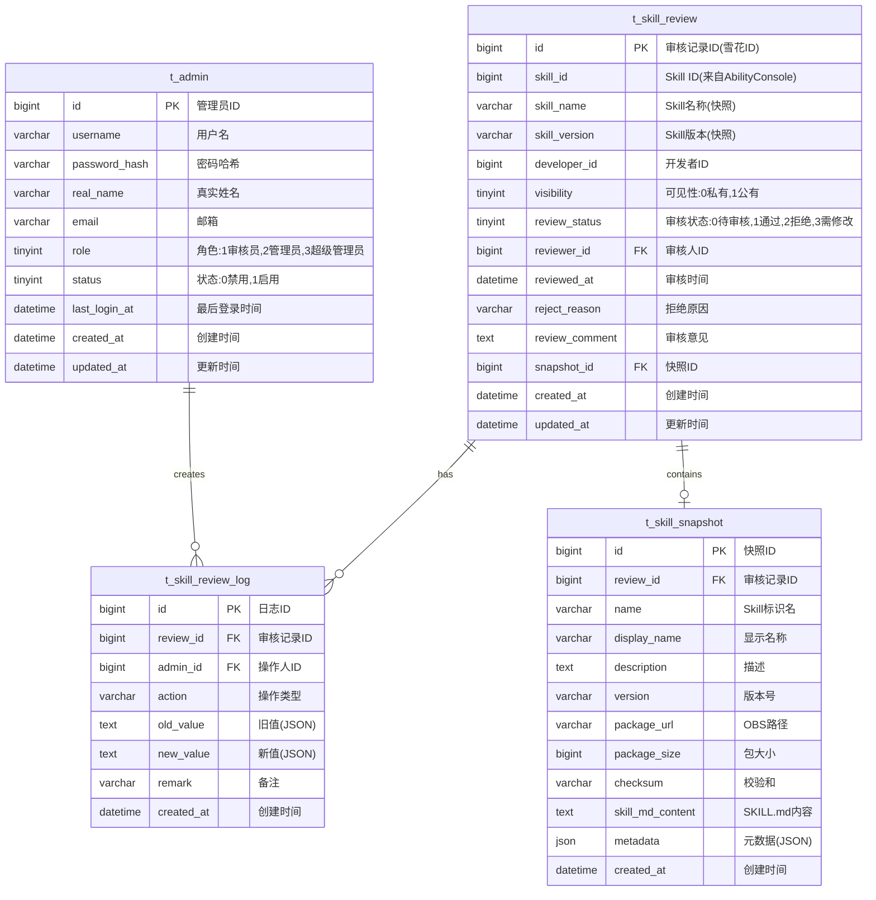
```mermaid
erDiagram
    t_skill_review ||--o{ t_skill_review_log : has
    t_skill_review ||--o| t_skill_snapshot : contains
    t_admin ||--o{ t_skill_review_log : creates

    t_skill_review {
        bigint id PK "审核记录ID(雪花ID)"
        bigint skill_id "Skill ID(来自AbilityConsole)"
        varchar skill_name "Skill名称(快照)"
        varchar skill_version "Skill版本(快照)"
        bigint developer_id "开发者ID"
        tinyint visibility "可见性:0私有,1公有"
        tinyint review_status "审核状态:0待审核,1通过,2拒绝,3需修改"
        bigint reviewer_id FK "审核人ID"
        datetime reviewed_at "审核时间"
        varchar reject_reason "拒绝原因"
        text review_comment "审核意见"
        bigint snapshot_id FK "快照ID"
        datetime created_at "创建时间"
        datetime updated_at "更新时间"
    }

    t_skill_review_log {
        bigint id PK "日志ID"
        bigint review_id FK "审核记录ID"
        bigint admin_id FK "操作人ID"
        varchar action "操作类型"
        text old_value "旧值(JSON)"
        text new_value "新值(JSON)"
        varchar remark "备注"
        datetime created_at "创建时间"
    }

    t_skill_snapshot {
        bigint id PK "快照ID"
        bigint review_id FK "审核记录ID"
        varchar name "Skill标识名"
        varchar display_name "显示名称"
        text description "描述"
        varchar version "版本号"
        varchar package_url "OBS路径"
        bigint package_size "包大小"
        varchar checksum "校验和"
        text skill_md_content "SKILL.md内容"
        json metadata "元数据(JSON)"
        datetime created_at "创建时间"
    }

    t_admin {
        bigint id PK "管理员ID"
        varchar username "用户名"
        varchar password_hash "密码哈希"
        varchar real_name "真实姓名"
        varchar email "邮箱"
        tinyint role "角色:1审核员,2管理员,3超级管理员"
        tinyint status "状态:0禁用,1启用"
        datetime last_login_at "最后登录时间"
        datetime created_at "创建时间"
        datetime updated_at "更新时间"
    }
```

#### 5.4.2 表结构定义

##### t_skill_review (审核记录表)

| 字段名 | 类型 | 必填 | 默认值 | 说明 |
|--------|------|------|--------|------|
| id | BIGINT | 是 | 雪花ID | 主键 |
| skill_id | BIGINT | 是 | - | Skill ID(来自AbilityConsole) |
| skill_name | VARCHAR(128) | 是 | - | Skill名称(快照) |
| skill_version | VARCHAR(32) | 是 | - | Skill版本(快照) |
| developer_id | BIGINT | 是 | - | 开发者ID |
| visibility | TINYINT | 是 | - | 可见性: 0=私有, 1=公有 |
| review_status | TINYINT | 是 | 0 | 审核状态: 0=待审核, 1=通过, 2=拒绝, 3=需修改 |
| reviewer_id | BIGINT | 否 | NULL | 审核人ID |
| reviewed_at | DATETIME | 否 | NULL | 审核时间 |
| reject_reason | VARCHAR(512) | 否 | NULL | 拒绝原因 |
| review_comment | TEXT | 否 | NULL | 审核意见 |
| snapshot_id | BIGINT | 否 | NULL | 快照ID |
| created_at | DATETIME | 是 | CURRENT_TIMESTAMP | 创建时间 |
| updated_at | DATETIME | 是 | CURRENT_TIMESTAMP | 更新时间 |

**索引设计**:
```sql
PRIMARY KEY (id)
INDEX idx_skill_id (skill_id)
INDEX idx_review_status (review_status)
INDEX idx_developer_id (developer_id)
INDEX idx_created_at (created_at)
INDEX idx_reviewer_id (reviewer_id)
```

##### t_skill_review_log (审核日志表)

| 字段名 | 类型 | 必填 | 默认值 | 说明 |
|--------|------|------|--------|------|
| id | BIGINT | 是 | 雪花ID | 主键 |
| review_id | BIGINT | 是 | - | 审核记录ID |
| admin_id | BIGINT | 是 | - | 操作人ID |
| action | VARCHAR(64) | 是 | - | 操作类型: SUBMIT, APPROVE, REJECT, NEED_MODIFY |
| old_value | TEXT | 否 | NULL | 旧值(JSON格式) |
| new_value | TEXT | 否 | NULL | 新值(JSON格式) |
| remark | VARCHAR(512) | 否 | NULL | 备注 |
| created_at | DATETIME | 是 | CURRENT_TIMESTAMP | 创建时间 |

**索引设计**:
```sql
PRIMARY KEY (id)
INDEX idx_review_id (review_id)
INDEX idx_admin_id (admin_id)
INDEX idx_created_at (created_at)
```

##### t_skill_snapshot (Skill快照表)

| 字段名 | 类型 | 必填 | 默认值 | 说明 |
|--------|------|------|--------|------|
| id | BIGINT | 是 | 雪花ID | 主键 |
| review_id | BIGINT | 是 | - | 审核记录ID |
| name | VARCHAR(128) | 是 | - | Skill标识名 |
| display_name | VARCHAR(256) | 否 | NULL | 显示名称 |
| description | TEXT | 是 | - | 描述 |
| version | VARCHAR(32) | 是 | - | 版本号 |
| package_url | VARCHAR(512) | 是 | - | OBS路径 |
| package_size | BIGINT | 是 | 0 | 包大小(字节) |
| checksum | VARCHAR(64) | 否 | NULL | 校验和(MD5) |
| skill_md_content | TEXT | 否 | NULL | SKILL.md完整内容 |
| metadata | JSON | 否 | NULL | 其他元数据(license,compatibility等) |
| created_at | DATETIME | 是 | CURRENT_TIMESTAMP | 创建时间 |

**索引设计**:
```sql
PRIMARY KEY (id)
INDEX idx_review_id (review_id)
INDEX idx_skill_name (name)
```

##### t_admin (管理员表)

| 字段名 | 类型 | 必填 | 默认值 | 说明 |
|--------|------|------|--------|------|
| id | BIGINT | 是 | 雪花ID | 主键 |
| username | VARCHAR(64) | 是 | - | 用户名，唯一 |
| password_hash | VARCHAR(256) | 是 | - | 密码哈希(bcrypt) |
| real_name | VARCHAR(64) | 否 | NULL | 真实姓名 |
| email | VARCHAR(128) | 否 | NULL | 邮箱 |
| role | TINYINT | 是 | 1 | 角色: 1=审核员, 2=管理员, 3=超级管理员 |
| status | TINYINT | 是 | 1 | 状态: 0=禁用, 1=启用 |
| last_login_at | DATETIME | 否 | NULL | 最后登录时间 |
| created_at | DATETIME | 是 | CURRENT_TIMESTAMP | 创建时间 |
| updated_at | DATETIME | 是 | CURRENT_TIMESTAMP | 更新时间 |

**索引设计**:
```sql
PRIMARY KEY (id)
UNIQUE INDEX uk_username (username)
INDEX idx_status (status)
```

---

### 5.5 SkillStore 数据库设计

> **数据库**: `skill_store`
> **字符集**: `utf8mb4`
> **排序规则**: `utf8mb4_unicode_ci`

#### 5.5.1 ER图

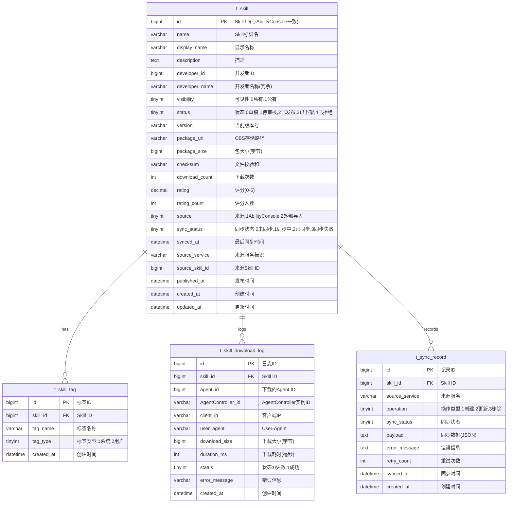
```mermaid
erDiagram
    t_skill ||--o{ t_skill_tag : has
    t_skill ||--o{ t_skill_download_log : logs
    t_skill ||--o{ t_sync_record : records

    t_skill {
        bigint id PK "Skill ID(与AbilityConsole一致)"
        varchar name "Skill标识名"
        varchar display_name "显示名称"
        text description "描述"
        bigint developer_id "开发者ID"
        varchar developer_name "开发者名称(冗余)"
        tinyint visibility "可见性:0私有,1公有"
        tinyint status "状态:0草稿,1待审核,2已发布,3已下架,4已拒绝"
        varchar version "当前版本号"
        varchar package_url "OBS存储路径"
        bigint package_size "包大小(字节)"
        varchar checksum "文件校验和"
        int download_count "下载次数"
        decimal rating "评分(0-5)"
        int rating_count "评分人数"
        tinyint source "来源:1AbilityConsole,2外部导入"
        tinyint sync_status "同步状态:0未同步,1同步中,2已同步,3同步失败"
        datetime synced_at "最后同步时间"
        varchar source_service "来源服务标识"
        bigint source_skill_id "来源Skill ID"
        datetime published_at "发布时间"
        datetime created_at "创建时间"
        datetime updated_at "更新时间"
    }

    t_skill_tag {
        bigint id PK "标签ID"
        bigint skill_id FK "Skill ID"
        varchar tag_name "标签名称"
        tinyint tag_type "标签类型:1系统,2用户"
        datetime created_at "创建时间"
    }

    t_skill_download_log {
        bigint id PK "日志ID"
        bigint skill_id FK "Skill ID"
        bigint agent_id "下载的Agent ID"
        varchar AgentController_id "AgentController实例ID"
        varchar client_ip "客户端IP"
        varchar user_agent "User-Agent"
        bigint download_size "下载大小(字节)"
        int duration_ms "下载耗时(毫秒)"
        tinyint status "状态:0失败,1成功"
        varchar error_message "错误信息"
        datetime created_at "创建时间"
    }

    t_sync_record {
        bigint id PK "记录ID"
        bigint skill_id FK "Skill ID"
        varchar source_service "来源服务"
        tinyint operation "操作类型:1创建,2更新,3删除"
        tinyint sync_status "同步状态"
        text payload "同步数据(JSON)"
        text error_message "错误信息"
        int retry_count "重试次数"
        datetime synced_at "同步时间"
        datetime created_at "创建时间"
    }
```

#### 5.5.2 表结构定义

##### t_skill (Skill元数据表)

| 字段名 | 类型 | 必填 | 默认值 | 说明 |
|--------|------|------|--------|------|
| id | BIGINT | 是 | - | 主键(与AbilityConsole的Skill ID一致) |
| name | VARCHAR(128) | 是 | - | Skill标识名，全局唯一 |
| display_name | VARCHAR(256) | 否 | NULL | 显示名称 |
| description | TEXT | 是 | - | 描述信息 |
| developer_id | BIGINT | 是 | - | 开发者ID |
| developer_name | VARCHAR(128) | 否 | NULL | 开发者名称(冗余字段) |
| visibility | TINYINT | 是 | 0 | 可见性: 0=私有, 1=公有 |
| status | TINYINT | 是 | 0 | 状态: 0=草稿, 1=待审核, 2=已发布, 3=已下架, 4=已拒绝 |
| version | VARCHAR(32) | 是 | '1.0.0' | 当前版本号 |
| package_url | VARCHAR(512) | 是 | - | OBS存储路径 |
| package_size | BIGINT | 是 | 0 | 包大小(字节) |
| checksum | VARCHAR(64) | 否 | NULL | 文件MD5校验和 |
| download_count | INT | 是 | 0 | 累计下载次数 |
| rating | DECIMAL(2,1) | 是 | 0.0 | 评分(0.0-5.0) |
| rating_count | INT | 是 | 0 | 评分人数 |
| source | TINYINT | 是 | 1 | 来源: 1=AbilityConsole, 2=外部导入 |
| sync_status | TINYINT | 是 | 0 | 同步状态: 0=未同步, 1=同步中, 2=已同步, 3=同步失败 |
| synced_at | DATETIME | 否 | NULL | 最后同步时间 |
| source_service | VARCHAR(32) | 否 | NULL | 来源服务标识 |
| source_skill_id | BIGINT | 否 | NULL | 来源系统的Skill ID |
| published_at | DATETIME | 否 | NULL | 发布时间 |
| created_at | DATETIME | 是 | CURRENT_TIMESTAMP | 创建时间 |
| updated_at | DATETIME | 是 | CURRENT_TIMESTAMP | 更新时间 |

**索引设计**:
```sql
PRIMARY KEY (id)
UNIQUE INDEX uk_name (name)
INDEX idx_developer_id (developer_id)
INDEX idx_visibility_status (visibility, status)
INDEX idx_status (status)
INDEX idx_download_count (download_count DESC)
INDEX idx_rating (rating DESC)
INDEX idx_sync_status (sync_status)
INDEX idx_published_at (published_at DESC)
```

##### t_skill_tag (Skill标签表)

| 字段名 | 类型 | 必填 | 默认值 | 说明 |
|--------|------|------|--------|------|
| id | BIGINT | 是 | 雪花ID | 主键 |
| skill_id | BIGINT | 是 | - | Skill ID |
| tag_name | VARCHAR(64) | 是 | - | 标签名称 |
| tag_type | TINYINT | 是 | 1 | 标签类型: 1=系统标签, 2=用户标签 |
| created_at | DATETIME | 是 | CURRENT_TIMESTAMP | 创建时间 |

**索引设计**:
```sql
PRIMARY KEY (id)
INDEX idx_skill_id (skill_id)
INDEX idx_tag_name (tag_name)
INDEX idx_skill_tag (skill_id, tag_name)
```

##### t_skill_download_log (下载日志表)

| 字段名 | 类型 | 必填 | 默认值 | 说明 |
|--------|------|------|--------|------|
| id | BIGINT | 是 | 雪花ID | 主键 |
| skill_id | BIGINT | 是 | - | Skill ID |
| agent_id | BIGINT | 否 | NULL | 下载的Agent ID |
| AgentController_id | VARCHAR(64) | 否 | NULL | AgentController实例ID |
| client_ip | VARCHAR(64) | 否 | NULL | 客户端IP |
| user_agent | VARCHAR(512) | 否 | NULL | User-Agent |
| download_size | BIGINT | 是 | 0 | 下载大小(字节) |
| duration_ms | INT | 否 | NULL | 下载耗时(毫秒) |
| status | TINYINT | 是 | 1 | 状态: 0=失败, 1=成功 |
| error_message | TEXT | 否 | NULL | 错误信息 |
| created_at | DATETIME | 是 | CURRENT_TIMESTAMP | 创建时间 |

**索引设计**:
```sql
PRIMARY KEY (id)
INDEX idx_skill_id (skill_id)
INDEX idx_agent_id (agent_id)
INDEX idx_created_at (created_at)
INDEX idx_status (status)
```

##### t_sync_record (同步记录表)

| 字段名 | 类型 | 必填 | 默认值 | 说明 |
|--------|------|------|--------|------|
| id | BIGINT | 是 | 雪花ID | 主键 |
| skill_id | BIGINT | 是 | - | Skill ID |
| source_service | VARCHAR(32) | 是 | - | 来源服务: ability_console |
| operation | TINYINT | 是 | - | 操作类型: 1=创建, 2=更新, 3=删除 |
| sync_status | TINYINT | 是 | 0 | 同步状态: 0=待处理, 1=成功, 2=失败 |
| payload | TEXT | 否 | NULL | 同步数据(JSON格式) |
| error_message | TEXT | 否 | NULL | 错误信息 |
| retry_count | INT | 是 | 0 | 重试次数 |
| synced_at | DATETIME | 否 | NULL | 同步完成时间 |
| created_at | DATETIME | 是 | CURRENT_TIMESTAMP | 创建时间 |

**索引设计**:
```sql
PRIMARY KEY (id)
INDEX idx_skill_id (skill_id)
INDEX idx_sync_status (sync_status)
INDEX idx_created_at (created_at)
```

---

### 5.6 数据同步关系图

```mermaid
flowchart TB
    subgraph "AbilityConsole 数据源"
        AB_SKILL[(t_skill)]
        AB_FILE[(t_skill_file)]
        AB_BIND[(t_agent_skill_binding)]
    end

    subgraph "同步机制"
        SYNC1[同步API<br/>POST /internal/skills/sync]
        SYNC2[回调API<br/>POST /internal/skills/callback]
        MQ[消息队列<br/>可选]
    end

    subgraph "SkillStore 数据副本"
        SS_SKILL[(t_skill)]
        SS_TAG[(t_skill_tag)]
        SS_SYNC[(t_sync_record)]
    end

    subgraph "HAGManager 数据副本"
        HM_REVIEW[(t_skill_review)]
        HM_SNAP[(t_skill_snapshot)]
        HM_LOG[(t_skill_review_log)]
    end

    AB_SKILL -->|导入时同步| SYNC1
    SYNC1 --> SS_SKILL
    SYNC1 --> SS_SYNC

    AB_SKILL -->|提交审核时同步| SYNC2
    SYNC2 --> HM_REVIEW
    SYNC2 --> HM_SNAP

    HM_REVIEW -->|审核通过更新| SS_SKILL

    AB_SKILL -.->|异步消息| MQ
    MQ -.-> SS_SKILL
```

### 5.7 关键字段枚举值

#### 5.7.1 Skill状态 (status)

| 值 | 名称 | 说明 |
|----|------|------|
| 0 | DRAFT | 草稿状态，开发者编辑中 |
| 1 | PENDING_REVIEW | 待审核状态 |
| 2 | PUBLISHED | 已发布，公开可见 |
| 3 | TAKEDOWN | 已下架 |
| 4 | REJECTED | 审核被拒绝 |

#### 5.7.2 可见性 (visibility)

| 值 | 名称 | 说明 |
|----|------|------|
| 0 | PRIVATE | 私有，仅所有者可见可绑定 |
| 1 | PUBLIC | 公有，所有人可见可绑定 |

#### 5.7.3 同步状态 (sync_status)

| 值 | 名称 | 说明 |
|----|------|------|
| 0 | NOT_SYNCED | 未同步 |
| 1 | SYNCING | 同步中 |
| 2 | SYNCED | 已同步 |
| 3 | SYNC_FAILED | 同步失败 |

#### 5.7.4 审核状态 (review_status)

| 值 | 名称 | 说明 |
|----|------|------|
| 0 | PENDING | 待审核 |
| 1 | APPROVED | 审核通过 |
| 2 | REJECTED | 审核拒绝 |
| 3 | NEED_MODIFY | 需要修改 |

#### 5.7.5 管理员角色 (role)

| 值 | 名称 | 权限说明 |
|----|------|----------|
| 1 | REVIEWER | 审核员，仅能审核Skill |
| 2 | ADMIN | 管理员，可审核、下架Skill |
| 3 | SUPER_ADMIN | 超级管理员，全部权限+管理员管理 |

---

## 六、安全架构设计

### 6.1 安全检查流程

```mermaid
flowchart TD
    subgraph "上传安全检查"
        A[文件上传] --> B{文件类型校验}
        B -->|非.zip| Z1[拒绝: 文件类型错误]
        B -->|.zip| C{文件大小校验}
        C -->|>50MB| Z2[拒绝: 文件过大]
        C -->|<=50MB| D[解压文件]
        D --> E{路径遍历检测}
        E -->|存在../| Z3[拒绝: 路径遍历攻击]
        E -->|安全| F{文件数量校验}
        F -->|>100个| Z4[拒绝: 文件过多]
        F -->|<=100个| G{单文件大小校验}
        G -->|>10MB| Z5[拒绝: 单文件过大]
        G -->|<=10MB| H[协议规范校验]
    end

    subgraph "协议规范校验"
        H --> I{SKILL.md存在?}
        I -->|不存在| Z6[拒绝: 缺少SKILL.md]
        I -->|存在| J{YAML格式正确?}
        J -->|不正确| Z7[拒绝: YAML格式错误]
        J -->|正确| K{name字段校验}
        K -->|不符合规范| Z8[拒绝: name格式错误]
        K -->|符合| L{description存在?}
        L -->|不存在| Z9[拒绝: 缺少description]
        L -->|存在| M[安全内容扫描]
    end

    subgraph "安全内容扫描"
        M --> N{敏感信息检测}
        N -->|发现敏感信息| Z10[拒绝: 包含敏感信息]
        N -->|安全| O{恶意代码扫描}
        O -->|发现恶意代码| Z11[拒绝: 包含恶意代码]
        O -->|安全| P[通过所有检查]
    end
```

### 6.2 安全检查详细设计

#### 6.2.1 安全检查整体流程

```mermaid
flowchart TD
    subgraph "基础校验"
        A[文件上传] --> B{文件类型校验}
        B -->|非.zip| Z1[拒绝: 文件类型错误]
        B -->|.zip| C{文件大小校验}
        C -->|>50MB| Z2[拒绝: 文件过大]
        C -->|<=50MB| D[解压文件]
        D --> E{路径遍历检测}
        E -->|存在../| Z3[拒绝: 路径遍历攻击]
        E -->|安全| F{文件数量校验}
        F -->|>100个| Z4[拒绝: 文件过多]
        F -->|<=100个| G{单文件大小校验}
        G -->|>10MB| Z5[拒绝: 单文件过大]
        G -->|<=10MB| H[协议规范校验]
    end

    subgraph "协议规范校验"
        H --> I{SKILL.md存在?}
        I -->|不存在| Z6[拒绝: 缺少SKILL.md]
        I -->|存在| J{YAML格式正确?}
        J -->|不正确| Z7[拒绝: YAML格式错误]
        J -->|正确| K{name字段校验}
        K -->|不符合规范| Z8[拒绝: name格式错误]
        K -->|符合| L{description存在?}
        L -->|不存在| Z9[拒绝: 缺少description]
        L -->|存在| M[安全内容扫描]
    end

    subgraph "安全内容扫描"
        M --> N[敏感信息检测]
        N --> O{发现敏感信息?}
        O -->|是| Z10[拒绝: 包含敏感信息]
        O -->|否| P[恶意代码扫描]
        P --> Q{发现恶意代码?}
        Q -->|是| Z11[拒绝: 包含恶意代码]
        Q -->|否| R[通过所有检查]
    end
```

#### 6.2.2 敏感信息检测

##### 检测范围

| 类型 | 示例 | 检测方式 |
|------|------|----------|
| 密钥凭证 | API Key, Access Token, Secret Key, Private Key | 正则匹配 + 大模型验证 |
| 连接字符串 | 数据库连接串、带密码的URL | 正则匹配 + 大模型验证 |
| 个人隐私信息 | 身份证号、银行卡号、手机号 | 正则匹配 |

##### 检测流程

```mermaid
flowchart TD
    A[文本文件内容] --> B[正则规则匹配]
    B --> C{命中规则?}
    C -->|否| D[标记为安全]
    C -->|是| E[提取命中上下文]
    E --> F[大模型二次判断]
    F --> G{确认为敏感信息?}
    G -->|否| D
    G -->|是| H[记录敏感信息类型和位置]
    H --> I[返回检测结果]
    D --> I
```

##### 正则规则示例

```regex
# API Key 模式
(?i)(api[_-]?key|access[_-]?token|secret[_-]?key)\s*[:=]\s*['"]?[\w\-]{16,}['"]?

# 数据库连接字符串
(?i)(mysql|postgres|mongodb|redis)://[^\s]+:[^\s]+@[^\s]+

# 私钥格式
-----BEGIN (RSA |EC |DSA )?PRIVATE KEY-----

# 身份证号
[1-9]\d{5}(18|19|20)\d{2}(0[1-9]|1[0-2])(0[1-9]|[12]\d|3[01])\d{3}[\dXx]

# 手机号
1[3-9]\d{9}

# 银行卡号
[1-9]\d{15,18}
```

#### 6.2.3 恶意代码扫描

##### 技术方案

采用**内部部署的大模型**对所有文本文件进行恶意代码扫描，确保数据不出域。

```mermaid
flowchart TD
    subgraph "文件分类"
        A[Skill包解压] --> B{文件类型判断}
        B -->|文本文件| C[加入扫描队列]
        B -->|二进制文件| D[跳过扫描]
    end

    subgraph "大模型扫描"
        C --> E[文件内容预处理]
        E --> F[构建安全检查Prompt]
        F --> G[调用内部部署模型]
        G --> H{模型判断结果}
        H -->|安全| I[标记文件安全]
        H -->|可疑| J[记录风险详情]
        H -->|恶意| K[标记为恶意代码]
    end

    subgraph "结果汇总"
        I --> L[汇总所有文件结果]
        J --> L
        K --> L
        L --> M{存在恶意/可疑?}
        M -->|是| N[返回风险报告]
        M -->|否| O[扫描通过]
    end
```

##### 扫描覆盖的文件类型

| 文件类型 | 扩展名 | 扫描策略 |
|----------|--------|----------|
| 源代码文件 | .py, .js, .ts, .java, .go, .rs 等 | 全量扫描 |
| 脚本文件 | .sh, .bat, .ps1, .vbs 等 | 全量扫描 |
| 配置文件 | .json, .yaml, .yml, .xml, .ini 等 | 全量扫描 |
| 其他文本文件 | .md, .txt, .csv 等 | 全量扫描 |
| 二进制文件 | .exe, .dll, .so, .png 等 | 跳过扫描 |

##### 大模型Prompt设计

```
你是一个安全代码审计专家。请分析以下代码/配置文件，判断是否包含恶意行为。

检查要点：
1. 危险函数调用：eval, exec, system, shell, subprocess等
2. 网络行为：异常外连、数据外传、C2通信特征
3. 文件操作：敏感路径访问、权限篡改
4. 加密混淆：可疑的编码/加密行为
5. 反射注入：动态代码加载、内存操作

文件名：{filename}
文件内容：
```
{content}
```

请以JSON格式返回分析结果：
{
  "risk_level": "safe|suspicious|malicious",
  "risk_type": "具体风险类型，如为safe则填null",
  "reason": "判断理由",
  "location": "风险代码位置（行号或片段）"
}
```

##### 风险等级定义

| 风险等级 | 说明 | 处理方式 |
|----------|------|----------|
| safe | 未发现风险 | 允许上传 |
| suspicious | 存在可疑代码，需人工确认 | 允许上传，标记待审核 |
| malicious | 确认为恶意代码 | 拒绝上传，返回风险详情 |

#### 6.2.4 扫描性能优化

```mermaid
flowchart LR
    subgraph "并行处理"
        A[文件队列] --> B[Worker 1]
        A --> C[Worker 2]
        A --> D[Worker 3]
        A --> E[Worker N]
    end

    subgraph "缓存优化"
        F[文件Hash计算] --> G{缓存命中?}
        G -->|是| H[返回缓存结果]
        G -->|否| I[执行扫描]
        I --> J[写入缓存]
    end
```

**优化策略**：
1. **文件级并行**：多个文件并行调用大模型
2. **结果缓存**：相同文件内容的扫描结果缓存24小时
3. **文件大小限制**：超过100KB的文件分块处理或摘要分析
4. **超时控制**：单文件扫描超时30秒，超时标记为suspicious

#### 6.2.5 安全检查时序图

```mermaid
sequenceDiagram
    autonumber
    participant D as Developer
    participant AC as AbilityConsole
    participant SC as SecurityChecker
    participant LLM as 内部大模型

    D->>AC: 上传Skill.zip
    activate AC

    AC->>SC: 提交安全检查请求
    activate SC

    SC->>SC: 基础校验(格式、大小、路径)

    SC->>SC: 协议规范校验(SKILL.md)

    SC->>SC: 敏感信息正则匹配

    alt 命中敏感信息规则
        SC->>LLM: 二次验证是否为真实敏感信息
        LLM-->>SC: 返回判断结果
    end

    loop 每个文本文件
        SC->>LLM: 恶意代码扫描请求
        LLM-->>SC: 返回风险等级
    end

    SC-->>AC: 返回检查报告
    deactivate SC

    alt 检查通过
        AC-->>D: 上传成功
    else 检查失败
        AC-->>D: 返回风险详情
    end

    deactivate AC
```

### 6.3 下载URL安全流程

```mermaid
sequenceDiagram
    autonumber
    participant RT as AgentController
    participant SS as SkillStore
    participant OBS as 对象存储<br/>(含签名服务)

    RT->>SS: 请求下载URL
    SS->>SS: 验证AgentController身份
    SS->>SS: 检查Skill访问权限

    alt 无权限或身份验证失败
        SS-->>RT: 返回401/403错误
    else 有权限
        SS->>OBS: 请求生成签名URL
        OBS-->>SS: 返回临时签名URL(1小时有效)
        SS->>SS: 记录下载日志
        SS-->>RT: 返回签名URL
        RT->>OBS: 使用签名URL下载
        OBS->>OBS: 验证签名有效性
        OBS-->>RT: 返回文件内容
    end
```

### 6.3 访问控制矩阵

```mermaid
graph TB
    subgraph "权限矩阵"
        A["开发者(所有者)"]
        B["开发者(非所有者)"]
        C["管理员"]
        D["AgentController"]

        A -->|创建/查看/更新/删除/提交审核/绑定| SKILL[Skill]
        B -->|仅查看公有| SKILL
        C -->|审核/下架/查看所有| SKILL
        D -->|下载已绑定Skill| SKILL
    end
```

---

## 七、错误处理设计

### 7.1 错误处理流程

```mermaid
flowchart TD
    A[请求到达] --> B{参数校验}
    B -->|失败| C[返回400错误]
    B -->|通过| D{认证校验}
    D -->|失败| E[返回401错误]
    D -->|通过| F{权限校验}
    F -->|失败| G[返回403错误]
    F -->|通过| H{业务处理}
    H -->|资源不存在| I[返回404错误]
    H -->|状态冲突| J[返回409错误]
    H -->|业务错误| K[返回业务错误码]
    H -->|系统异常| L[返回500错误]
    H -->|成功| M[返回200成功]
```

### 7.2 错误码分类

```mermaid
mindmap
  root((错误码))
    通用错误
      400xxx 参数错误
      401xxx 认证错误
      403xxx 权限错误
      404xxx 资源不存在
      500xxx 服务器错误
    Skill业务错误
      100001 Skill不存在
      100002 名称已存在
      100003 状态不允许
      100004 文件格式错误
      100005 解析失败
      100006 协议校验失败
      100007 同步失败
      100008 已绑定
      100009 绑定数量超限
      100010 包大小超限
      100011 敏感信息检测失败
      100012 审核记录不存在
```

---

## 八、性能优化设计

### 8.1 缓存策略

```mermaid
flowchart LR
    subgraph "缓存层"
        R1[(Redis<br/>Skill元数据缓存)]
        R2[(Redis<br/>绑定关系缓存)]
        R3[(本地缓存<br/>热门Skill)]
    end

    RT[AgentController] --> R2
    R2 -->|miss| AB[(AbilityConsole DB)]

    SS[SkillStore] --> R1
    R1 -->|miss| SDB[(SkillStore DB)]

    SS --> R3
```

### 8.2 批量查询优化

```mermaid
sequenceDiagram
    participant RT as AgentController
    participant SS as SkillStore
    participant Cache as Redis
    participant DB as MySQL

    RT->>SS: 批量查询(50个Skill ID)
    activate SS

    SS->>Cache: 批量查询缓存
    Cache-->>SS: 返回缓存命中结果

    alt 有未命中
        SS->>DB: 批量查询未命中ID
        DB-->>SS: 返回查询结果
        SS->>Cache: 写入缓存
    end

    SS-->>RT: 返回合并结果
    deactivate SS
```

---


## 九、接口设计参考

详细的OpenAPI规范请参考:
- [AbilityConsole API](./openapi-ability-console.yaml)
- [HAGManager API](./openapi-hag-manager.yaml)
- [SkillStore API](./openapi-skill-store.yaml)

---

## 十、关键设计决策

### 10.1 为什么SkillStore存储私有Skill？
- 导入即同步，简化同步逻辑
- 便于AgentController统一从SkillStore获取数据
- 通过visibility字段控制可见性

### 10.2 为什么绑定关系存在AbilityConsole？
- 绑定关系是Agent的属性，应与Agent数据同库
- AgentController先从AbilityConsole获取绑定关系，再从SkillStore获取详情
- 便于开发者在一个系统内管理Agent的所有配置

### 10.3 为什么更新需要重新审核？
- 确保公开Skill的内容质量和安全性
- 防止恶意更新注入违规内容
- 符合应用商店的通用审核机制

---

## 十一、附录

### 11.1 AgentSkill协议参考
- 官网：https://agentskills.io
- 规范：https://agentskills.io/specification
- 示例：https://github.com/anthropics/skills

### 11.2 SKILL.md示例
```yaml
---
name: pdf-processing
description: Extracts text and tables from PDF files, fills forms, merges documents. Use when working with PDF files or when users mention PDFs, forms, or document extraction.
license: Apache-2.0
compatibility: Requires Python 3.8+
metadata:
  author: example-org
  version: "1.0"
allowed-tools: Bash(python:*) Read Write
---

# PDF Processing Skill

## When to use this skill
Use this skill when the user needs to:
- Extract text from PDF documents
- Fill PDF forms
- Merge multiple PDFs

## How to extract text
1. Use pdfplumber for text extraction
2. Handle multi-page documents

## Available scripts
- `scripts/extract.py` - Extract text from PDF
- `scripts/merge.py` - Merge multiple PDFs
```