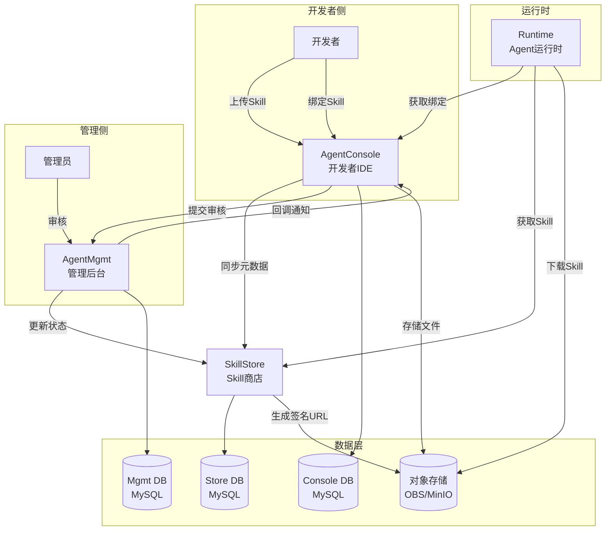
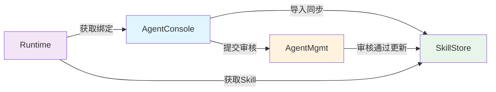
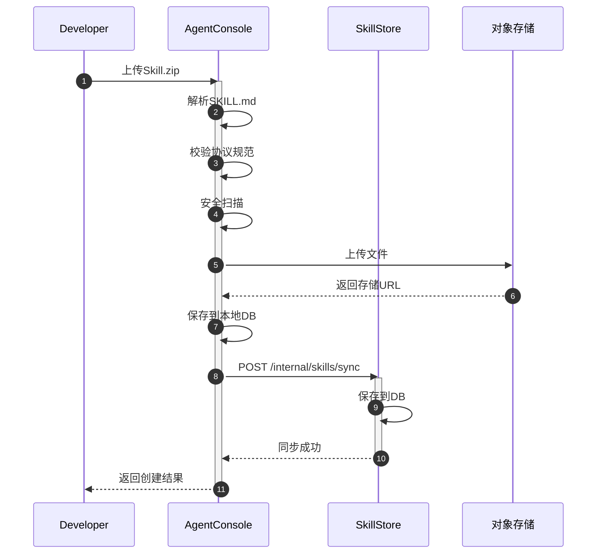
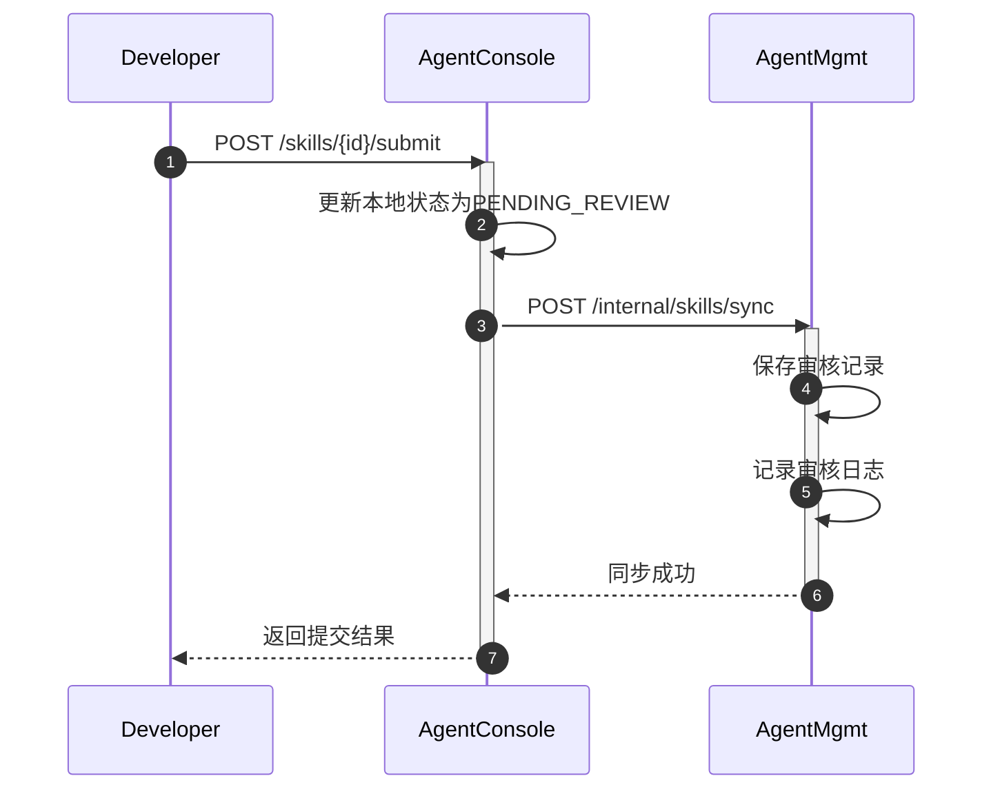
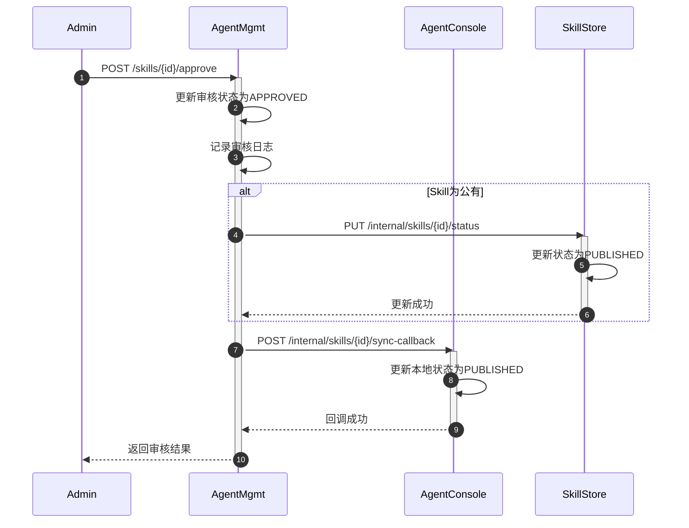
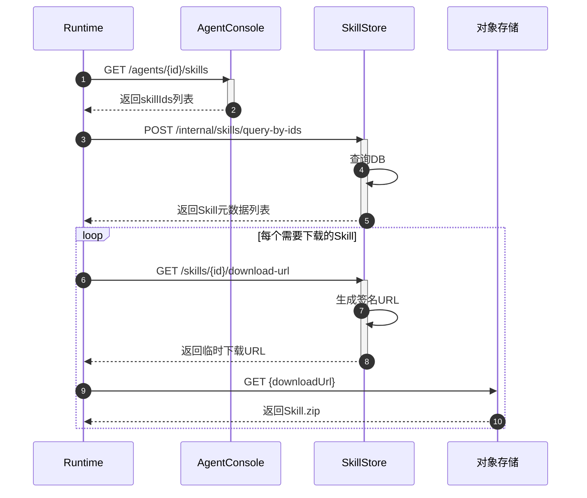
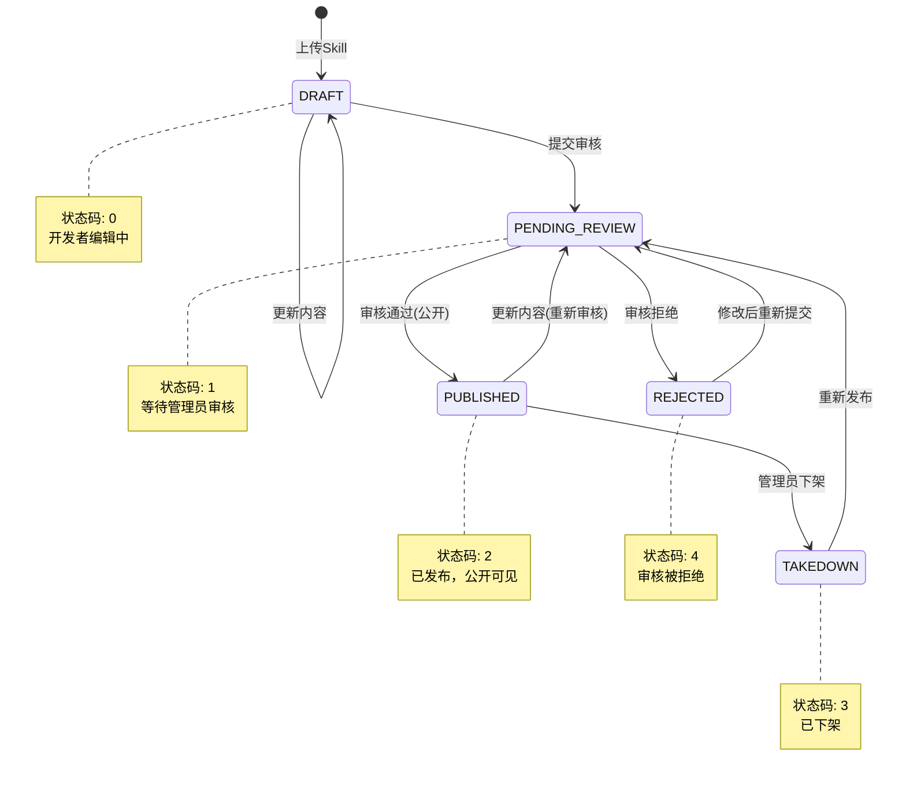

# AgentSkill协议支持技术方案

## 一、背景与目标

### 1.1 背景
为Agent平台（类似coze.cn的低码大模型应用平台）新增AgentSkill协议支持，遵循agentskills.io开放标准。

### 1.2 系统架构概览

#### 1.2.1 系统架构图（Mermaid）


#### 1.2.2 服务依赖关系图


### 1.3 核心需求
1. 开发者上传Skill.zip到AgentConsole，默认私有
2. 导入后同步元数据到SkillStore
3. 提交审核时同步到AgentMgmt
4. 审核通过且公开时更新SkillStore状态
5. Skill与Agent多对多关系，按ID绑定，绑定关系存储在AgentConsole
6. 兼容agentskills.io生态
7. Runtime从SkillStore获取签名临时URL下载Skill

### 1.4 服务间调用关系
```
AgentConsole → SkillStore: 导入成功后同步Skill元数据
AgentConsole → AgentMgmt: 提交审核时同步Skill数据
AgentMgmt → SkillStore: 审核通过且公开时更新状态
Runtime → SkillStore: 查询Skill信息、获取下载URL
```

---

## 二、AgentSkill协议规范

### 2.1 目录结构
```
skill-name/
├── SKILL.md          # 必需：YAML frontmatter + Markdown指令
├── scripts/          # 可选：可执行脚本
├── references/       # 可选：参考文档
└── assets/           # 可选：静态资源
```

### 2.2 SKILL.md格式
```yaml
---
name: skill-name              # 必需：1-64字符，小写字母数字连字符
description: 描述内容          # 必需：1-1024字符
license: Apache-2.0           # 可选
compatibility: 环境要求        # 可选
metadata:                     # 可选
  author: xxx
  version: "1.0"
allowed-tools: Bash(git:*)    # 可选
---
# Markdown指令内容
```

### 2.3 工作流程
Discovery → Load metadata → Match → Activate → Execute

---

## 三、数据库设计（分微服务）

### 3.1 AgentConsole数据库

#### 3.1.1 Skill主表
```sql
CREATE TABLE ac_skill (
    id VARCHAR(32) PRIMARY KEY COMMENT 'Skill唯一ID（UUID）',
    name VARCHAR(64) NOT NULL COMMENT 'Skill名称(协议name字段)',
    display_name VARCHAR(128) COMMENT '显示名称',
    description VARCHAR(1024) NOT NULL COMMENT '描述',
    developer_id VARCHAR(32) NOT NULL COMMENT '开发者ID',
    visibility TINYINT DEFAULT 0 COMMENT '可见性: 0-私有 1-公有',
    status TINYINT DEFAULT 0 COMMENT '状态: 0-草稿 1-待审核 2-已发布 3-已下架 4-已拒绝',
    license VARCHAR(64) COMMENT '许可证',
    compatibility VARCHAR(500) COMMENT '兼容性要求',
    allowed_tools TEXT COMMENT '预批准工具列表(JSON数组)',
    metadata_json TEXT COMMENT '扩展元数据(JSON对象)',
    version VARCHAR(32) DEFAULT '1.0.0' COMMENT '版本号',
    version_code INT DEFAULT 1 COMMENT '版本码',
    skill_md_hash VARCHAR(64) COMMENT 'SKILL.md内容哈希',
    package_url VARCHAR(512) COMMENT '对象存储URL',
    package_size BIGINT COMMENT '包大小(bytes)',
    store_sync_status TINYINT DEFAULT 0 COMMENT 'SkillStore同步状态: 0-未同步 1-已同步 2-同步失败',
    store_synced_at DATETIME COMMENT 'SkillStore同步时间',
    mgmt_sync_status TINYINT DEFAULT 0 COMMENT 'AgentMgmt同步状态: 0-未同步 1-已同步 2-同步失败',
    mgmt_synced_at DATETIME COMMENT 'AgentMgmt同步时间',
    created_at DATETIME DEFAULT CURRENT_TIMESTAMP,
    updated_at DATETIME DEFAULT CURRENT_TIMESTAMP ON UPDATE CURRENT_TIMESTAMP,
    deleted_at DATETIME COMMENT '软删除时间',
    INDEX idx_developer (developer_id),
    INDEX idx_status_visibility (status, visibility),
    INDEX idx_store_sync (store_sync_status),
    UNIQUE KEY uk_developer_name (developer_id, name)
) ENGINE=InnoDB DEFAULT CHARSET=utf8mb4 COMMENT='Skill主表';
```

#### 3.1.2 Skill文件表
```sql
CREATE TABLE ac_skill_file (
    id VARCHAR(32) PRIMARY KEY,
    skill_id VARCHAR(32) NOT NULL COMMENT 'Skill ID',
    file_path VARCHAR(256) NOT NULL COMMENT '文件相对路径',
    file_type VARCHAR(32) COMMENT '文件类型: skill_md/script/reference/asset',
    storage_url VARCHAR(512) COMMENT '对象存储URL',
    file_size BIGINT COMMENT '文件大小',
    mime_type VARCHAR(128) COMMENT 'MIME类型',
    created_at DATETIME DEFAULT CURRENT_TIMESTAMP,
    INDEX idx_skill (skill_id),
    UNIQUE KEY uk_skill_path (skill_id, file_path)
) ENGINE=InnoDB DEFAULT CHARSET=utf8mb4 COMMENT='Skill文件表';
```

#### 3.1.3 Agent-Skill绑定表
```sql
CREATE TABLE ac_agent_skill_binding (
    id VARCHAR(32) PRIMARY KEY,
    agent_id VARCHAR(32) NOT NULL COMMENT 'Agent ID',
    skill_id VARCHAR(32) NOT NULL COMMENT 'Skill ID',
    skill_name VARCHAR(64) NOT NULL COMMENT 'Skill名称(冗余)',
    skill_version VARCHAR(32) COMMENT '绑定的Skill版本',
    binding_config TEXT COMMENT '绑定配置(JSON)',
    priority INT DEFAULT 0 COMMENT '优先级(越大越优先)',
    enabled TINYINT DEFAULT 1 COMMENT '是否启用: 0-禁用 1-启用',
    created_at DATETIME DEFAULT CURRENT_TIMESTAMP,
    updated_at DATETIME DEFAULT CURRENT_TIMESTAMP ON UPDATE CURRENT_TIMESTAMP,
    INDEX idx_agent (agent_id),
    INDEX idx_skill (skill_id),
    UNIQUE KEY uk_agent_skill (agent_id, skill_id)
) ENGINE=InnoDB DEFAULT CHARSET=utf8mb4 COMMENT='Agent-Skill绑定表';
```

---

### 3.2 AgentMgmt数据库

#### 3.2.1 Skill审核主表
```sql
CREATE TABLE am_skill_review (
    id VARCHAR(32) PRIMARY KEY COMMENT '与Console的skill.id一致',
    name VARCHAR(64) NOT NULL COMMENT 'Skill名称',
    display_name VARCHAR(128) COMMENT '显示名称',
    description VARCHAR(1024) NOT NULL COMMENT '描述',
    developer_id VARCHAR(32) NOT NULL COMMENT '开发者ID',
    developer_name VARCHAR(128) COMMENT '开发者名称(冗余)',
    visibility TINYINT DEFAULT 0 COMMENT '可见性: 0-私有 1-公有',
    status TINYINT DEFAULT 1 COMMENT '审核状态: 1-待审核 2-已通过 3-已拒绝',
    license VARCHAR(64) COMMENT '许可证',
    compatibility VARCHAR(500) COMMENT '兼容性要求',
    allowed_tools TEXT COMMENT '预批准工具列表(JSON)',
    metadata_json TEXT COMMENT '扩展元数据(JSON)',
    version VARCHAR(32) COMMENT '版本号',
    package_url VARCHAR(512) COMMENT '对象存储URL',
    package_size BIGINT COMMENT '包大小',
    reviewer_id VARCHAR(32) COMMENT '审核人ID',
    reviewer_name VARCHAR(64) COMMENT '审核人名称',
    review_comment TEXT COMMENT '审核意见',
    reviewed_at DATETIME COMMENT '审核时间',
    created_at DATETIME DEFAULT CURRENT_TIMESTAMP,
    updated_at DATETIME DEFAULT CURRENT_TIMESTAMP ON UPDATE CURRENT_TIMESTAMP,
    INDEX idx_developer (developer_id),
    INDEX idx_status (status),
    INDEX idx_created_at (created_at)
) ENGINE=InnoDB DEFAULT CHARSET=utf8mb4 COMMENT='Skill审核主表';
```

#### 3.2.2 审核日志表
```sql
CREATE TABLE am_skill_review_log (
    id BIGINT AUTO_INCREMENT PRIMARY KEY,
    skill_id VARCHAR(32) NOT NULL COMMENT 'Skill ID',
    skill_name VARCHAR(64) COMMENT 'Skill名称',
    action VARCHAR(32) NOT NULL COMMENT '操作: submit/approve/reject/takedown/republish',
    from_status TINYINT COMMENT '原状态',
    to_status TINYINT COMMENT '目标状态',
    operator_id VARCHAR(32) COMMENT '操作人ID',
    operator_name VARCHAR(64) COMMENT '操作人名称',
    comment TEXT COMMENT '审核意见/备注',
    created_at DATETIME DEFAULT CURRENT_TIMESTAMP,
    INDEX idx_skill (skill_id),
    INDEX idx_created_at (created_at)
) ENGINE=InnoDB DEFAULT CHARSET=utf8mb4 COMMENT='Skill审核日志表';
```

---

### 3.3 SkillStore数据库

#### 3.3.1 Skill商店主表
```sql
CREATE TABLE ss_skill (
    id VARCHAR(32) PRIMARY KEY COMMENT '与Console的skill.id一致',
    name VARCHAR(64) NOT NULL COMMENT 'Skill名称',
    display_name VARCHAR(128) COMMENT '显示名称',
    description VARCHAR(1024) NOT NULL COMMENT '描述',
    developer_id VARCHAR(32) NOT NULL COMMENT '开发者ID',
    developer_name VARCHAR(128) COMMENT '开发者名称(冗余)',
    visibility TINYINT DEFAULT 0 COMMENT '可见性: 0-私有 1-公有',
    status TINYINT DEFAULT 0 COMMENT '状态: 0-未发布 1-已发布 2-已下架',
    license VARCHAR(64) COMMENT '许可证',
    compatibility VARCHAR(500) COMMENT '兼容性要求',
    allowed_tools TEXT COMMENT '预批准工具列表(JSON)',
    metadata_json TEXT COMMENT '扩展元数据(JSON)',
    version VARCHAR(32) COMMENT '版本号',
    package_url VARCHAR(512) COMMENT '对象存储URL',
    package_size BIGINT COMMENT '包大小',
    install_count INT DEFAULT 0 COMMENT '下载/安装次数',
    category VARCHAR(64) COMMENT '分类',
    tags VARCHAR(512) COMMENT '标签(JSON数组)',
    created_at DATETIME DEFAULT CURRENT_TIMESTAMP,
    updated_at DATETIME DEFAULT CURRENT_TIMESTAMP ON UPDATE CURRENT_TIMESTAMP,
    INDEX idx_developer (developer_id),
    INDEX idx_status_visibility (status, visibility),
    INDEX idx_category (category),
    FULLTEXT INDEX ft_name_desc (name, description)
) ENGINE=InnoDB DEFAULT CHARSET=utf8mb4 COMMENT='Skill商店主表';
```

#### 3.3.2 Skill下载记录表
```sql
CREATE TABLE ss_skill_download_log (
    id BIGINT AUTO_INCREMENT PRIMARY KEY,
    skill_id VARCHAR(32) NOT NULL COMMENT 'Skill ID',
    downloader_id VARCHAR(32) COMMENT '下载者ID(开发者或Agent)',
    downloader_type VARCHAR(32) COMMENT '下载者类型: developer/agent/runtime',
    download_url VARCHAR(512) COMMENT '下载URL',
    ip_address VARCHAR(64) COMMENT 'IP地址',
    created_at DATETIME DEFAULT CURRENT_TIMESTAMP,
    INDEX idx_skill (skill_id),
    INDEX idx_downloader (downloader_id),
    INDEX idx_created_at (created_at)
) ENGINE=InnoDB DEFAULT CHARSET=utf8mb4 COMMENT='Skill下载记录表';
```

---

### 3.4 数据同步说明

| 数据流向 | 同步时机 | 同步内容 | 同步字段 |
|---------|---------|---------|---------|
| AgentConsole → SkillStore | Skill导入成功后 | 元数据+URL | id, name, display_name, description, developer_id, visibility, status, license, compatibility, allowed_tools, metadata_json, version, package_url, package_size |
| AgentConsole → AgentMgmt | 提交审核时 | 元数据+URL | id, name, display_name, description, developer_id, developer_name, visibility, status, license, compatibility, allowed_tools, metadata_json, version, package_url, package_size |
| AgentMgmt → SkillStore | 审核通过且公开时 | 状态更新 | id, status, visibility, reviewer_id, reviewer_name, reviewed_at |

---

## 四、API接口详细设计

### 4.1 AgentConsole接口

#### 4.1.1 Skill管理接口

**上传Skill**
```
POST /api/v1/console/skills
Content-Type: multipart/form-data

Request:
- file: Skill.zip文件
- name: Skill名称（可选，默认从SKILL.md解析）
- visibility: 可见性（可选，默认0-私有）

Response 200:
{
  "code": 0,
  "message": "success",
  "data": {
    "id": "sk_xxx",
    "name": "pdf-processing",
    "displayName": "PDF Processing",
    "description": "...",
    "visibility": 0,
    "status": 0,
    "version": "1.0.0",
    "storeSyncStatus": 1,
    "storeSyncedAt": "2026-02-28T10:00:00Z",
    "createdAt": "2026-02-28T10:00:00Z"
  }
}
```

**获取Skill列表**
```
GET /api/v1/console/skills

Query Parameters:
- page: 页码（默认1）
- pageSize: 每页数量（默认20）
- status: 状态筛选（可选）
- visibility: 可见性筛选（可选）
- keyword: 关键词搜索（可选）

Response 200:
{
  "code": 0,
  "data": {
    "total": 100,
    "page": 1,
    "pageSize": 20,
    "list": [
      {
        "id": "sk_xxx",
        "name": "pdf-processing",
        "displayName": "PDF Processing",
        "description": "...",
        "visibility": 0,
        "status": 0,
        "version": "1.0.0",
        "installCount": 10,
        "createdAt": "2026-02-28T10:00:00Z"
      }
    ]
  }
}
```

**获取Skill详情**
```
GET /api/v1/console/skills/{skillId}

Response 200:
{
  "code": 0,
  "data": {
    "id": "sk_xxx",
    "name": "pdf-processing",
    "displayName": "PDF Processing",
    "description": "...",
    "developerId": "dev_xxx",
    "visibility": 0,
    "status": 0,
    "license": "Apache-2.0",
    "compatibility": "...",
    "allowedTools": ["Bash", "Read"],
    "metadata": {"author": "xxx"},
    "version": "1.0.0",
    "packageUrl": "https://OBS.xxx/skills/xxx.zip",
    "packageSize": 102400,
    "storeSyncStatus": 1,
    "mgmtSyncStatus": 0,
    "createdAt": "2026-02-28T10:00:00Z",
    "updatedAt": "2026-02-28T10:00:00Z",
    "files": [
      {
        "filePath": "SKILL.md",
        "fileType": "skill_md",
        "fileSize": 2048
      },
      {
        "filePath": "scripts/extract.py",
        "fileType": "script",
        "fileSize": 1024
      }
    ]
  }
}
```

**更新Skill元数据**
```
PUT /api/v1/console/skills/{skillId}

Request:
{
  "displayName": "PDF Processing Tool",
  "description": "新描述",
  "visibility": 1
}

Response 200:
{
  "code": 0,
  "message": "success"
}
```

**删除Skill**
```
DELETE /api/v1/console/skills/{skillId}

Response 200:
{
  "code": 0,
  "message": "success"
}
```

**提交审核**
```
POST /api/v1/console/skills/{skillId}/submit

Request:
{
  "visibility": 1,
  "notes": "首次发布"
}

Response 200:
{
  "code": 0,
  "message": "success",
  "data": {
    "skillId": "sk_xxx",
    "status": 1,
    "mgmtSyncStatus": 1
  }
}
```

#### 4.1.2 Agent-Skill绑定接口

**获取Agent已绑定的Skill列表**
```
GET /api/v1/console/agents/{agentId}/skills

Response 200:
{
  "code": 0,
  "data": {
    "total": 5,
    "list": [
      {
        "id": "bind_xxx",
        "skillId": "sk_xxx",
        "skillName": "pdf-processing",
        "skillVersion": "1.0.0",
        "priority": 10,
        "enabled": 1,
        "bindingConfig": {},
        "createdAt": "2026-02-28T10:00:00Z"
      }
    ]
  }
}
```

**绑定Skill到Agent**
```
POST /api/v1/console/agents/{agentId}/skills

Request:
{
  "skillId": "sk_xxx",
  "priority": 10,
  "enabled": 1,
  "bindingConfig": {}
}

Response 200:
{
  "code": 0,
  "message": "success",
  "data": {
    "id": "bind_xxx",
    "agentId": "agent_xxx",
    "skillId": "sk_xxx",
    "skillName": "pdf-processing"
  }
}
```

**更新绑定配置**
```
PUT /api/v1/console/agents/{agentId}/skills/{skillId}

Request:
{
  "priority": 20,
  "enabled": 1,
  "bindingConfig": {"autoActivate": true}
}

Response 200:
{
  "code": 0,
  "message": "success"
}
```

**解绑Skill**
```
DELETE /api/v1/console/agents/{agentId}/skills/{skillId}

Response 200:
{
  "code": 0,
  "message": "success"
}
```

#### 4.1.3 内部同步接口（供SkillStore/AgentMgmt回调）

**同步状态更新回调**
```
POST /api/v1/console/internal/skills/{skillId}/sync-callback

Request:
{
  "target": "store|mgmt",
  "status": "success|failed",
  "syncedAt": "2026-02-28T10:00:00Z",
  "errorMessage": "错误信息（失败时）"
}

Response 200:
{
  "code": 0,
  "message": "success"
}
```

---

### 4.2 AgentMgmt接口

#### 4.2.1 审核管理接口

**获取待审核Skill列表**
```
GET /api/v1/mgmt/skills/pending

Query Parameters:
- page: 页码
- pageSize: 每页数量
- keyword: 关键词搜索

Response 200:
{
  "code": 0,
  "data": {
    "total": 20,
    "list": [
      {
        "id": "sk_xxx",
        "name": "pdf-processing",
        "displayName": "PDF Processing",
        "description": "...",
        "developerId": "dev_xxx",
        "developerName": "张三",
        "visibility": 1,
        "status": 1,
        "version": "1.0.0",
        "packageSize": 102400,
        "createdAt": "2026-02-28T10:00:00Z"
      }
    ]
  }
}
```

**获取审核详情**
```
GET /api/v1/mgmt/skills/{skillId}

Response 200:
{
  "code": 0,
  "data": {
    "id": "sk_xxx",
    "name": "pdf-processing",
    "displayName": "PDF Processing",
    "description": "...",
    "developerId": "dev_xxx",
    "developerName": "张三",
    "visibility": 1,
    "status": 1,
    "license": "Apache-2.0",
    "compatibility": "...",
    "allowedTools": ["Bash", "Read"],
    "metadata": {},
    "version": "1.0.0",
    "packageUrl": "https://OBS.xxx/skills/xxx.zip",
    "packageSize": 102400,
    "createdAt": "2026-02-28T10:00:00Z",
    "reviewLogs": [
      {
        "action": "submit",
        "operatorName": "张三",
        "comment": "首次发布",
        "createdAt": "2026-02-28T10:00:00Z"
      }
    ]
  }
}
```

**审核通过**
```
POST /api/v1/mgmt/skills/{skillId}/approve

Request:
{
  "comment": "审核通过"
}

Response 200:
{
  "code": 0,
  "message": "success",
  "data": {
    "skillId": "sk_xxx",
    "status": 2,
    "storeSyncStatus": 1
  }
}
```

**审核拒绝**
```
POST /api/v1/mgmt/skills/{skillId}/reject

Request:
{
  "reason": "不符合规范",
  "comment": "SKILL.md格式错误"
}

Response 200:
{
  "code": 0,
  "message": "success"
}
```

**下架Skill**
```
POST /api/v1/mgmt/skills/{skillId}/takedown

Request:
{
  "reason": "违规内容",
  "comment": "包含敏感信息"
}

Response 200:
{
  "code": 0,
  "message": "success"
}
```

**获取审核历史**
```
GET /api/v1/mgmt/skills/{skillId}/logs

Response 200:
{
  "code": 0,
  "data": [
    {
      "id": 1,
      "action": "submit",
      "fromStatus": 0,
      "toStatus": 1,
      "operatorName": "张三",
      "comment": "首次发布",
      "createdAt": "2026-02-28T10:00:00Z"
    },
    {
      "id": 2,
      "action": "approve",
      "fromStatus": 1,
      "toStatus": 2,
      "operatorName": "管理员",
      "comment": "审核通过",
      "createdAt": "2026-02-28T11:00:00Z"
    }
  ]
}
```

#### 4.2.2 内部接口（供AgentConsole调用）

**接收Skill审核数据**
```
POST /api/v1/mgmt/internal/skills/sync

Request:
{
  "id": "sk_xxx",
  "name": "pdf-processing",
  "displayName": "PDF Processing",
  "description": "...",
  "developerId": "dev_xxx",
  "developerName": "张三",
  "visibility": 1,
  "status": 1,
  "license": "Apache-2.0",
  "compatibility": "...",
  "allowedTools": ["Bash", "Read"],
  "metadata": {},
  "version": "1.0.0",
  "packageUrl": "https://OBS.xxx/skills/xxx.zip",
  "packageSize": 102400
}

Response 200:
{
  "code": 0,
  "message": "success"
}
```

---

### 4.3 SkillStore接口

#### 4.3.1 公开接口

**浏览公有Skill列表**
```
GET /api/v1/store/skills

Query Parameters:
- page: 页码
- pageSize: 每页数量
- category: 分类筛选
- keyword: 关键词搜索
- sortBy: 排序字段（installCount/createdAt）
- sortOrder: 排序方向（asc/desc）

Response 200:
{
  "code": 0,
  "data": {
    "total": 100,
    "page": 1,
    "pageSize": 20,
    "list": [
      {
        "id": "sk_xxx",
        "name": "pdf-processing",
        "displayName": "PDF Processing",
        "description": "...",
        "developerId": "dev_xxx",
        "developerName": "张三",
        "license": "Apache-2.0",
        "version": "1.0.0",
        "installCount": 100,
        "category": "文档处理",
        "tags": ["pdf", "文档"],
        "createdAt": "2026-02-28T10:00:00Z"
      }
    ]
  }
}
```

**获取Skill详情**
```
GET /api/v1/store/skills/{skillId}

Response 200:
{
  "code": 0,
  "data": {
    "id": "sk_xxx",
    "name": "pdf-processing",
    "displayName": "PDF Processing",
    "description": "...",
    "developerId": "dev_xxx",
    "developerName": "张三",
    "license": "Apache-2.0",
    "compatibility": "...",
    "allowedTools": ["Bash", "Read"],
    "metadata": {},
    "version": "1.0.0",
    "packageSize": 102400,
    "installCount": 100,
    "category": "文档处理",
    "tags": ["pdf", "文档"],
    "createdAt": "2026-02-28T10:00:00Z"
  }
}
```

**搜索Skill**
```
GET /api/v1/store/skills/search

Query Parameters:
- q: 搜索关键词
- page: 页码
- pageSize: 每页数量

Response 200: (同浏览列表)
```

**获取Skill下载URL**
```
GET /api/v1/store/skills/{skillId}/download-url

Query Parameters:
- expiresIn: URL有效期（秒，默认3600）

Response 200:
{
  "code": 0,
  "data": {
    "skillId": "sk_xxx",
    "downloadUrl": "https://OBS.xxx/skills/xxx.zip?signature=xxx&expires=xxx",
    "expiresAt": "2026-02-28T11:00:00Z"
  }
}
```

#### 4.3.2 内部接口（供AgentConsole/AgentMgmt/Runtime调用）

**接收Skill同步数据**
```
POST /api/v1/store/internal/skills/sync

Request:
{
  "id": "sk_xxx",
  "name": "pdf-processing",
  "displayName": "PDF Processing",
  "description": "...",
  "developerId": "dev_xxx",
  "developerName": "张三",
  "visibility": 0,
  "status": 0,
  "license": "Apache-2.0",
  "compatibility": "...",
  "allowedTools": ["Bash", "Read"],
  "metadata": {},
  "version": "1.0.0",
  "packageUrl": "https://OBS.xxx/skills/xxx.zip",
  "packageSize": 102400
}

Response 200:
{
  "code": 0,
  "message": "success"
}
```

**更新Skill状态（供AgentMgmt调用）**
```
PUT /api/v1/store/internal/skills/{skillId}/status

Request:
{
  "status": 1,
  "visibility": 1
}

Response 200:
{
  "code": 0,
  "message": "success"
}
```

**获取Agent可用的Skill列表（供Runtime调用）**
```
POST /api/v1/store/internal/skills/query-by-ids

Request:
{
  "skillIds": ["sk_xxx", "sk_yyy"]
}

Response 200:
{
  "code": 0,
  "data": [
    {
      "id": "sk_xxx",
      "name": "pdf-processing",
      "displayName": "PDF Processing",
      "description": "...",
      "version": "1.0.0",
      "packageUrl": "https://OBS.xxx/skills/xxx.zip",
      "allowedTools": ["Bash", "Read"]
    }
  ]
}
```

---

## 五、服务间调用时序图

### 5.1 Skill导入流程

#### 5.1.1 时序图（ASCII）
```
┌─────────────┐     ┌─────────────┐     ┌─────────────┐     ┌─────────────┐
│  Developer  │     │AgentConsole │     │  SkillStore │     │     OBS     │
└──────┬──────┘     └──────┬──────┘     └──────┬──────┘     └──────┬──────┘
       │                   │                   │                   │
       │  1. 上传Skill.zip │                   │                   │
       │──────────────────▶│                   │                   │
       │                   │                   │                   │
       │                   │  2. 解析SKILL.md  │                   │
       │                   │  校验协议规范     │                   │
       │                   │                   │                   │
       │                   │  3. 上传文件到OBS │                   │
       │                   │──────────────────────────────────────▶│
       │                   │                   │                   │
       │                   │  4. 返回存储URL   │                   │
       │                   │◀──────────────────────────────────────│
       │                   │                   │                   │
       │                   │  5. 保存到本地DB  │                   │
       │                   │                   │                   │
       │                   │  6. 同步元数据到SkillStore            │
       │                   │──────────────────▶│                   │
       │                   │  POST /internal/skills/sync           │
       │                   │                   │                   │
       │                   │                   │  7. 保存到DB      │
       │                   │                   │                   │
       │                   │  8. 同步成功      │                   │
       │                   │◀──────────────────│                   │
       │                   │                   │                   │
       │  9. 返回创建结果  │                   │                   │
       │◀──────────────────│                   │                   │
       │                   │                   │                   │
```

#### 5.1.2 时序图（Mermaid）


---

### 5.2 提交审核流程

#### 5.2.1 时序图（ASCII）
```
┌─────────────┐     ┌─────────────┐     ┌─────────────┐     ┌─────────────┐
│  Developer  │     │AgentConsole │     │  AgentMgmt  │     │  SkillStore │
└──────┬──────┘     └──────┬──────┘     └──────┬──────┘     └──────┬──────┘
       │                   │                   │                   │
       │  1. 提交审核      │                   │                   │
       │──────────────────▶│                   │                   │
       │                   │                   │                   │
       │                   │  2. 更新本地状态  │                   │
       │                   │                   │                   │
       │                   │  3. 同步到AgentMgmt                   │
       │                   │──────────────────▶│                   │
       │                   │  POST /internal/skills/sync           │
       │                   │                   │                   │
       │                   │                   │  4. 保存审核记录  │
       │                   │                   │                   │
       │                   │  5. 同步成功      │                   │
       │                   │◀──────────────────│                   │
       │                   │                   │                   │
       │  6. 返回提交结果  │                   │                   │
       │◀──────────────────│                   │                   │
       │                   │                   │                   │
```

#### 5.2.2 时序图（Mermaid）


---

### 5.3 审核通过流程

#### 5.3.1 时序图（ASCII）
```
┌─────────────┐     ┌─────────────┐     ┌─────────────┐     ┌─────────────┐
│   Admin     │     │  AgentMgmt  │     │ AgentConsole│     │  SkillStore │
└──────┬──────┘     └──────┬──────┘     └──────┬──────┘     └──────┬──────┘
       │                   │                   │                   │
       │  1. 审核通过      │                   │                   │
       │──────────────────▶│                   │                   │
       │                   │                   │                   │
       │                   │  2. 更新审核状态  │                   │
       │                   │  记录审核日志     │                   │
       │                   │                   │                   │
       │                   │  3. 若公开，更新SkillStore状态       │
       │                   │──────────────────────────────────────▶│
       │                   │  PUT /internal/skills/{id}/status     │
       │                   │                   │                   │
       │                   │                   │                   │  4. 更新状态
       │                   │                   │                   │
       │                   │  5. 通知AgentConsole审核结果          │
       │                   │──────────────────▶│                   │
       │                   │  POST /internal/skills/{id}/sync-callback
       │                   │                   │                   │
       │                   │                   │  6. 更新本地状态  │
       │                   │                   │                   │
       │  7. 返回审核结果  │                   │                   │
       │◀──────────────────│                   │                   │
       │                   │                   │                   │
```

#### 5.3.2 时序图（Mermaid）


---

### 5.4 Runtime获取Skill流程

#### 5.4.1 时序图（ASCII）
```
┌─────────────┐     ┌─────────────┐     ┌─────────────┐
│   Runtime   │     │ AgentConsole│     │  SkillStore │
└──────┬──────┘     └──────┬──────┘     └──────┬──────┘
       │                   │                   │
       │  1. 获取Agent绑定的SkillIds           │
       │──────────────────▶│                   │
       │  GET /agents/{id}/skills              │
       │                   │                   │
       │  2. 返回skillIds列表                  │
       │◀──────────────────│                   │
       │                   │                   │
       │  3. 批量查询Skill详情                 │
       │──────────────────────────────────────▶│
       │  POST /internal/skills/query-by-ids   │
       │                   │                   │
       │                   │                   │  4. 查询DB
       │  5. 返回Skill元数据列表               │
       │◀──────────────────────────────────────│
       │                   │                   │
       │  6. 获取Skill下载URL                  │
       │──────────────────────────────────────▶│
       │  GET /skills/{id}/download-url        │
       │                   │                   │
       │                   │                   │  7. 生成签名URL
       │  8. 返回带签名的临时URL               │
       │◀──────────────────────────────────────│
       │                   │                   │
       │  9. 下载Skill.zip                     │
       │  (直接访问OBS URL)                    │
       │                   │                   │
```

#### 5.4.2 时序图（Mermaid）


---

## 六、Skill生命周期状态机

### 6.1 状态定义

| 状态码 | 状态名 | 说明 |
|-------|--------|------|
| 0 | DRAFT | 草稿，开发者编辑中 |
| 1 | PENDING_REVIEW | 待审核 |
| 2 | PUBLISHED | 已发布（公有） |
| 3 | TAKEDOWN | 已下架 |
| 4 | REJECTED | 已拒绝 |

### 6.2 状态转换图

#### 6.2.1 状态图（ASCII）
```
                         ┌──────────────────────────────────────┐
                         │                                      │
                         ▼                                      │
┌─────────┐    上传    ┌─────────┐   提交审核   ┌───────────┐   │
│  新建   │ ────────▶ │  草稿   │ ──────────▶ │  待审核   │   │
│         │           │ DRAFT   │             │PENDING    │   │
└─────────┘           └────┬────┘             └─────┬─────┘   │
                           │                        │         │
                           │ 更新内容                │         │
                           │ (重新审核)              │         │
                           │                        │         │
                           │              ┌─────────┴─────────┤
                           │              │                   │
                           │              ▼                   ▼
                           │       ┌───────────┐       ┌───────────┐
                           │       │  已发布   │       │  已拒绝   │
                           │       │PUBLISHED  │       │ REJECTED  │
                           │       └─────┬─────┘       └─────┬─────┘
                           │             │                   │
                           │             │ 下架              │ 重新提交
                           │             ▼                   │
                           │      ┌───────────┐              │
                           │      │  已下架   │◀─────────────┘
                           │      │TAKEDOWN   │
                           │      └─────┬─────┘
                           │            │
                           │ 重新发布    │
                           └────────────┘
```

#### 6.2.2 状态图（Mermaid）


### 6.3 状态转换规则

| 当前状态 | 操作 | 目标状态 | 触发条件 |
|---------|------|---------|---------|
| - | 上传Skill | DRAFT | 开发者上传成功 |
| DRAFT | 提交审核 | PENDING_REVIEW | 开发者提交 |
| DRAFT | 更新内容 | DRAFT | 开发者更新 |
| PENDING_REVIEW | 审核通过 | PUBLISHED | 管理员通过且选择公开 |
| PENDING_REVIEW | 审核拒绝 | REJECTED | 管理员拒绝 |
| PUBLISHED | 下架 | TAKEDOWN | 管理员下架 |
| PUBLISHED | 更新内容 | PENDING_REVIEW | 开发者更新（需重新审核） |
| REJECTED | 重新提交 | PENDING_REVIEW | 开发者修改后重新提交 |
| TAKEDOWN | 重新发布 | PENDING_REVIEW | 开发者重新提交审核 |

---

## 七、安全措施

### 7.1 上传安全

```
┌─────────────────────────────────────────────────────────────────────────────┐
│                           Skill上传安全检查流程                               │
├─────────────────────────────────────────────────────────────────────────────┤
│                                                                             │
│   ┌─────────────┐     ┌─────────────┐     ┌─────────────┐                  │
│   │ 文件类型    │────▶│ 文件大小    │────▶│ 路径遍历    │                  │
│   │ 校验        │     │ 校验        │     │ 检测        │                  │
│   └─────────────┘     └─────────────┘     └─────────────┘                  │
│          │                   │                   │                         │
│          ▼                   ▼                   ▼                         │
│   仅允许.zip           最大50MB           检测../等                        │
│                                                                             │
│   ┌─────────────┐     ┌─────────────┐     ┌─────────────┐                  │
│   │ 协议规范    │────▶│ 敏感信息    │────▶│ 恶意代码    │                  │
│   │ 校验        │     │ 扫描        │     │ 扫描        │                  │
│   └─────────────┘     └─────────────┘     └─────────────┘                  │
│          │                   │                   │                         │
│          ▼                   ▼                   ▼                         │
│   SKILL.md格式          API Key/密码         可疑脚本                       │
│   name/description      私钥/Token           危险函数                       │
│                                                                             │
└─────────────────────────────────────────────────────────────────────────────┘
```

### 7.2 协议规范校验

| 字段 | 校验规则 |
|------|---------|
| name | 1-64字符，仅小写字母、数字、连字符，不能以连字符开头/结尾，不能有连续连字符 |
| description | 1-1024字符，不能为空 |
| SKILL.md | 必须存在于根目录，必须包含YAML frontmatter |
| scripts/ | 可选，仅允许 .py/.js/.ts/.sh 扩展名 |
| 文件数量 | 最多100个文件 |
| 单文件大小 | 最大10MB |

### 7.3 下载URL安全

```
签名URL生成流程：
1. Runtime请求下载URL
2. SkillStore验证请求者身份和权限
3. 生成带签名的临时URL（默认1小时有效）
4. 返回签名URL给Runtime
5. Runtime使用签名URL直接从OBS下载

签名URL格式：
https://OBS.example.com/skills/xxx.zip?
  OBSAccessKeyId=xxx&
  Expires=1709123456&
  Signature=xxxxxx
```

### 7.4 访问控制矩阵

| 操作 | 开发者（所有者） | 开发者（非所有者） | 管理员 | Runtime |
|------|----------------|-------------------|--------|---------|
| 创建Skill | ✅ | ❌ | ❌ | ❌ |
| 查看私有Skill | ✅ | ❌ | ✅ | ❌ |
| 查看公有Skill | ✅ | ✅ | ✅ | ✅ |
| 更新Skill | ✅ | ❌ | ❌ | ❌ |
| 删除Skill | ✅ | ❌ | ✅ | ❌ |
| 提交审核 | ✅ | ❌ | ❌ | ❌ |
| 审核通过/拒绝 | ❌ | ❌ | ✅ | ❌ |
| 下架Skill | ❌ | ❌ | ✅ | ❌ |
| 绑定Skill到Agent | ✅ | ❌ | ❌ | ❌ |
| 下载Skill | ✅ | ✅(公有) | ✅ | ✅(已绑定) |

---

## 八、错误码定义

### 8.1 通用错误码

| 错误码 | 说明 |
|-------|------|
| 0 | 成功 |
| 400001 | 参数错误 |
| 400002 | 请求体格式错误 |
| 401001 | 未认证 |
| 403001 | 无权限 |
| 404001 | 资源不存在 |
| 500001 | 服务器内部错误 |
| 500002 | 服务不可用 |

### 8.2 Skill业务错误码

| 错误码 | 说明 |
|-------|------|
| 100001 | Skill不存在 |
| 100002 | Skill名称已存在 |
| 100003 | Skill状态不允许此操作 |
| 100004 | Skill文件格式错误 |
| 100005 | SKILL.md解析失败 |
| 100006 | Skill协议校验失败 |
| 100007 | Skill同步失败 |
| 100008 | Skill已绑定到Agent |
| 100009 | Agent绑定Skill数量超限 |
| 100010 | Skill包大小超限 |
| 100011 | 敏感信息检测失败 |
| 100012 | 审核记录不存在 |

---

## 九、接口设计参考

详细的OpenAPI规范请参考:
- [AgentConsole API](./openapi-agent-console.yaml)
- [AgentMgmt API](./openapi-agent-mgmt.yaml)
- [SkillStore API](./openapi-skill-store.yaml)

---

## 十、关键设计决策

### 10.1 为什么SkillStore存储私有Skill？
- 导入即同步，简化同步逻辑
- 便于Runtime统一从SkillStore获取数据
- 通过visibility字段控制可见性

### 10.2 为什么绑定关系存在AgentConsole？
- 绑定关系是Agent的属性，应与Agent数据同库
- Runtime先从AgentConsole获取绑定关系，再从SkillStore获取详情
- 便于开发者在一个系统内管理Agent的所有配置

### 10.3 为什么更新需要重新审核？
- 确保公开Skill的内容质量和安全性
- 防止恶意更新注入违规内容
- 符合应用商店的通用审核机制

---

## 十一、附录

### 11.1 AgentSkill协议参考
- 官网：https://agentskills.io
- 规范：https://agentskills.io/specification
- 示例：https://github.com/anthropics/skills

### 11.2 SKILL.md示例
```yaml
---
name: pdf-processing
description: Extracts text and tables from PDF files, fills forms, merges documents. Use when working with PDF files or when users mention PDFs, forms, or document extraction.
license: Apache-2.0
compatibility: Requires Python 3.8+
metadata:
  author: example-org
  version: "1.0"
allowed-tools: Bash(python:*) Read Write
---

# PDF Processing Skill

## When to use this skill
Use this skill when the user needs to:
- Extract text from PDF documents
- Fill PDF forms
- Merge multiple PDFs

## How to extract text
1. Use pdfplumber for text extraction
2. Handle multi-page documents

## Available scripts
- `scripts/extract.py` - Extract text from PDF
- `scripts/merge.py` - Merge multiple PDFs
```

---

### 12.4 字段校验规则汇总

| 字段 | 类型 | 必填 | 校验规则 |
|------|------|------|---------|
| id | string | 是 | UUID格式，32字符 |
| name | string | 是 | 1-64字符，小写字母数字连字符，不能以连字符开头/结尾，不能有连续连字符，正则：`^[a-z0-9][a-z0-9-]*[a-z0-9]$`或`^[a-z0-9]$` |
| displayName | string | 否 | 最大128字符 |
| description | string | 是 | 1-1024字符 |
| developerId | string | 是 | 非空 |
| developerName | string | 否 | 最大128字符 |
| visibility | integer | 否 | 枚举值：0(私有)、1(公有)，默认0 |
| status | integer | 否 | 枚举值：0(草稿)、1(待审核)、2(已发布)、3(已下架)、4(已拒绝) |
| license | string | 否 | 最大64字符 |
| compatibility | string | 否 | 最大500字符 |
| allowedTools | array | 否 | 字符串数组 |
| metadata | object | 否 | JSON对象 |
| version | string | 否 | 最大32字符 |
| packageUrl | string | 否 | 最大512字符，URL格式 |
| packageSize | integer | 否 | 非负整数 |
| priority | integer | 否 | 0-100，默认0 |
| enabled | integer | 否 | 枚举值：0(禁用)、1(启用)，默认1 |
| bindingConfig | object | 否 | JSON对象 |
| page | integer | 否 | 最小1，默认1 |
| pageSize | integer | 否 | 最小1，最大100，默认20 |
| keyword | string | 否 | 最大100字符 |
| comment | string | 否 | 最大500字符 |
| reason | string | 是 | 最大100字符 |
| expiresIn | integer | 否 | 最小60，最大86400，默认3600 |